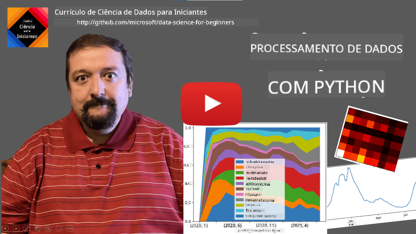
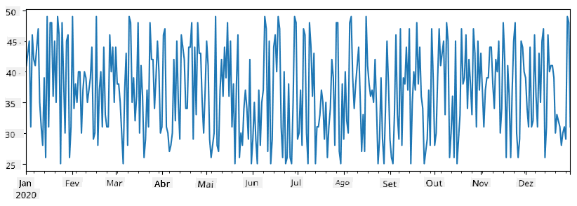
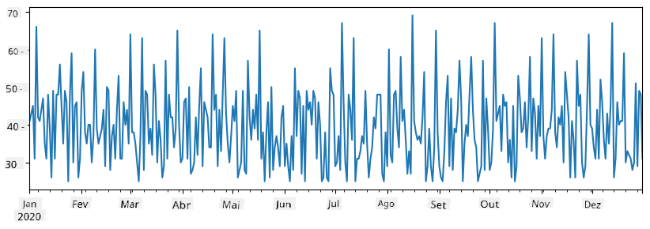
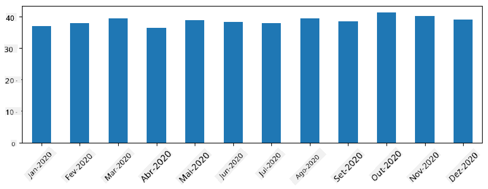
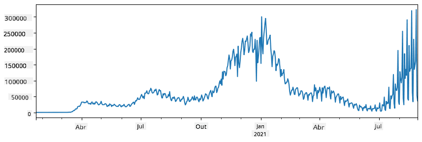
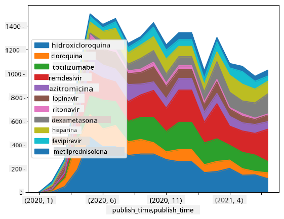

<!--
CO_OP_TRANSLATOR_METADATA:
{
  "original_hash": "116c5d361fbe812e59a73f37ce721d36",
  "translation_date": "2025-08-27T16:55:20+00:00",
  "source_file": "2-Working-With-Data/07-python/README.md",
  "language_code": "br"
}
-->
# Trabalhando com Dados: Python e a Biblioteca Pandas

|  ](../../sketchnotes/07-WorkWithPython.png) |
| :-------------------------------------------------------------------------------------------------------: |
|                 Trabalhando com Python - _Sketchnote por [@nitya](https://twitter.com/nitya)_             |

[](https://youtu.be/dZjWOGbsN4Y)

Embora bancos de dados ofereçam maneiras muito eficientes de armazenar e consultar dados usando linguagens de consulta, a forma mais flexível de processar dados é escrevendo seu próprio programa para manipulá-los. Em muitos casos, realizar uma consulta em banco de dados seria mais eficaz. No entanto, em alguns casos, quando é necessário um processamento de dados mais complexo, isso não pode ser feito facilmente usando SQL.  
O processamento de dados pode ser programado em qualquer linguagem de programação, mas existem certas linguagens que são mais adequadas para trabalhar com dados. Cientistas de dados geralmente preferem uma das seguintes linguagens:

* **[Python](https://www.python.org/)**, uma linguagem de programação de propósito geral, frequentemente considerada uma das melhores opções para iniciantes devido à sua simplicidade. Python possui muitas bibliotecas adicionais que podem ajudá-lo a resolver diversos problemas práticos, como extrair dados de um arquivo ZIP ou converter uma imagem para tons de cinza. Além da ciência de dados, Python também é amplamente utilizado para desenvolvimento web.  
* **[R](https://www.r-project.org/)** é uma ferramenta tradicional desenvolvida com foco no processamento estatístico de dados. Ela também contém um grande repositório de bibliotecas (CRAN), tornando-a uma boa escolha para processamento de dados. No entanto, R não é uma linguagem de programação de propósito geral e raramente é usada fora do domínio da ciência de dados.  
* **[Julia](https://julialang.org/)** é outra linguagem desenvolvida especificamente para ciência de dados. Ela foi projetada para oferecer melhor desempenho do que Python, tornando-se uma ótima ferramenta para experimentação científica.

Nesta lição, focaremos no uso do Python para processamento simples de dados. Assumiremos um conhecimento básico da linguagem. Se você quiser um tour mais aprofundado sobre Python, pode consultar um dos seguintes recursos:

* [Aprenda Python de Forma Divertida com Turtle Graphics e Fractais](https://github.com/shwars/pycourse) - Curso introdutório rápido baseado no GitHub sobre Programação em Python  
* [Dê seus Primeiros Passos com Python](https://docs.microsoft.com/en-us/learn/paths/python-first-steps/?WT.mc_id=academic-77958-bethanycheum) - Trilha de Aprendizado no [Microsoft Learn](http://learn.microsoft.com/?WT.mc_id=academic-77958-bethanycheum)

Os dados podem vir em muitas formas. Nesta lição, consideraremos três formas de dados - **dados tabulares**, **texto** e **imagens**.

Focaremos em alguns exemplos de processamento de dados, em vez de fornecer uma visão geral completa de todas as bibliotecas relacionadas. Isso permitirá que você entenda o que é possível e saiba onde encontrar soluções para seus problemas quando necessário.

> **Conselho mais útil**. Quando precisar realizar uma operação específica em dados e não souber como fazer, tente pesquisar na internet. O [Stackoverflow](https://stackoverflow.com/) geralmente contém muitos exemplos úteis de código em Python para várias tarefas típicas.

## [Questionário pré-aula](https://purple-hill-04aebfb03.1.azurestaticapps.net/quiz/12)

## Dados Tabulares e Dataframes

Você já encontrou dados tabulares quando falamos sobre bancos de dados relacionais. Quando você tem muitos dados contidos em várias tabelas vinculadas, definitivamente faz sentido usar SQL para trabalhar com eles. No entanto, há muitos casos em que temos uma tabela de dados e precisamos obter algum **entendimento** ou **insights** sobre esses dados, como a distribuição, correlação entre valores, etc. Na ciência de dados, há muitos casos em que precisamos realizar algumas transformações nos dados originais, seguidas de visualização. Ambas as etapas podem ser facilmente realizadas usando Python.

Existem duas bibliotecas mais úteis em Python que podem ajudá-lo a lidar com dados tabulares:
* **[Pandas](https://pandas.pydata.org/)** permite manipular os chamados **Dataframes**, que são análogos às tabelas relacionais. Você pode ter colunas nomeadas e realizar diferentes operações em linhas, colunas e dataframes em geral.  
* **[Numpy](https://numpy.org/)** é uma biblioteca para trabalhar com **tensores**, ou seja, **arrays** multidimensionais. Um array possui valores do mesmo tipo subjacente e é mais simples que um dataframe, mas oferece mais operações matemáticas e cria menos sobrecarga.

Existem também algumas outras bibliotecas que você deve conhecer:
* **[Matplotlib](https://matplotlib.org/)** é uma biblioteca usada para visualização de dados e criação de gráficos  
* **[SciPy](https://www.scipy.org/)** é uma biblioteca com algumas funções científicas adicionais. Já nos deparamos com essa biblioteca ao falar sobre probabilidade e estatística  

Aqui está um trecho de código que você normalmente usaria para importar essas bibliotecas no início do seu programa Python:  
```python
import numpy as np
import pandas as pd
import matplotlib.pyplot as plt
from scipy import ... # you need to specify exact sub-packages that you need
```  

Pandas é centrado em alguns conceitos básicos.

### Series

**Series** é uma sequência de valores, semelhante a uma lista ou array do numpy. A principal diferença é que uma série também possui um **índice**, e quando operamos em séries (por exemplo, somamos), o índice é levado em consideração. O índice pode ser tão simples quanto o número inteiro da linha (é o índice usado por padrão ao criar uma série a partir de uma lista ou array) ou pode ter uma estrutura complexa, como um intervalo de datas.

> **Nota**: Há algum código introdutório de Pandas no notebook associado [`notebook.ipynb`](notebook.ipynb). Aqui, apenas esboçamos alguns exemplos, mas você está definitivamente convidado a conferir o notebook completo.

Considere um exemplo: queremos analisar as vendas de nossa sorveteria. Vamos gerar uma série de números de vendas (número de itens vendidos a cada dia) para um determinado período de tempo:

```python
start_date = "Jan 1, 2020"
end_date = "Mar 31, 2020"
idx = pd.date_range(start_date,end_date)
print(f"Length of index is {len(idx)}")
items_sold = pd.Series(np.random.randint(25,50,size=len(idx)),index=idx)
items_sold.plot()
```  


Agora suponha que, a cada semana, organizamos uma festa para amigos e levamos 10 pacotes adicionais de sorvete para a festa. Podemos criar outra série, indexada por semana, para demonstrar isso:  
```python
additional_items = pd.Series(10,index=pd.date_range(start_date,end_date,freq="W"))
```  
Quando somamos duas séries, obtemos o número total:  
```python
total_items = items_sold.add(additional_items,fill_value=0)
total_items.plot()
```  


> **Nota** que não estamos usando a sintaxe simples `total_items+additional_items`. Se fizéssemos isso, receberíamos muitos valores `NaN` (*Not a Number*) na série resultante. Isso ocorre porque há valores ausentes para alguns dos pontos de índice na série `additional_items`, e somar `NaN` a qualquer coisa resulta em `NaN`. Assim, precisamos especificar o parâmetro `fill_value` durante a soma.

Com séries temporais, também podemos **reestruturar** a série com diferentes intervalos de tempo. Por exemplo, suponha que queremos calcular o volume médio de vendas mensalmente. Podemos usar o seguinte código:  
```python
monthly = total_items.resample("1M").mean()
ax = monthly.plot(kind='bar')
```  


### DataFrame

Um DataFrame é essencialmente uma coleção de séries com o mesmo índice. Podemos combinar várias séries em um DataFrame:  
```python
a = pd.Series(range(1,10))
b = pd.Series(["I","like","to","play","games","and","will","not","change"],index=range(0,9))
df = pd.DataFrame([a,b])
```  
Isso criará uma tabela horizontal como esta:  
|     | 0   | 1    | 2   | 3   | 4      | 5   | 6      | 7    | 8    |
| --- | --- | ---- | --- | --- | ------ | --- | ------ | ---- | ---- |
| 0   | 1   | 2    | 3   | 4   | 5      | 6   | 7      | 8    | 9    |
| 1   | I   | like | to  | use | Python | and | Pandas | very | much |

Também podemos usar Series como colunas e especificar nomes de colunas usando um dicionário:  
```python
df = pd.DataFrame({ 'A' : a, 'B' : b })
```  
Isso nos dará uma tabela como esta:

|     | A   | B      |
| --- | --- | ------ |
| 0   | 1   | I      |
| 1   | 2   | like   |
| 2   | 3   | to     |
| 3   | 4   | use    |
| 4   | 5   | Python |
| 5   | 6   | and    |
| 6   | 7   | Pandas |
| 7   | 8   | very   |
| 8   | 9   | much   |

**Nota** que também podemos obter esse layout de tabela transpondo a tabela anterior, por exemplo, escrevendo  
```python
df = pd.DataFrame([a,b]).T..rename(columns={ 0 : 'A', 1 : 'B' })
```  
Aqui `.T` significa a operação de transposição do DataFrame, ou seja, trocar linhas e colunas, e a operação `rename` nos permite renomear colunas para corresponder ao exemplo anterior.

Aqui estão algumas das operações mais importantes que podemos realizar em DataFrames:

**Seleção de colunas**. Podemos selecionar colunas individuais escrevendo `df['A']` - essa operação retorna uma Série. Também podemos selecionar um subconjunto de colunas em outro DataFrame escrevendo `df[['B','A']]` - isso retorna outro DataFrame.

**Filtragem** de certas linhas por critérios. Por exemplo, para manter apenas as linhas com a coluna `A` maior que 5, podemos escrever `df[df['A']>5]`.

> **Nota**: A forma como a filtragem funciona é a seguinte. A expressão `df['A']<5` retorna uma série booleana, que indica se a expressão é `True` ou `False` para cada elemento da série original `df['A']`. Quando a série booleana é usada como índice, ela retorna um subconjunto de linhas no DataFrame. Assim, não é possível usar expressões booleanas arbitrárias do Python, por exemplo, escrever `df[df['A']>5 and df['A']<7]` estaria errado. Em vez disso, você deve usar a operação especial `&` em séries booleanas, escrevendo `df[(df['A']>5) & (df['A']<7)]` (*os parênteses são importantes aqui*).

**Criação de novas colunas computáveis**. Podemos facilmente criar novas colunas computáveis para nosso DataFrame usando expressões intuitivas como esta:  
```python
df['DivA'] = df['A']-df['A'].mean() 
```  
Este exemplo calcula a divergência de A em relação ao seu valor médio. O que realmente acontece aqui é que estamos computando uma série e, em seguida, atribuindo essa série ao lado esquerdo, criando outra coluna. Assim, não podemos usar operações que não sejam compatíveis com séries, por exemplo, o código abaixo está errado:  
```python
# Wrong code -> df['ADescr'] = "Low" if df['A'] < 5 else "Hi"
df['LenB'] = len(df['B']) # <- Wrong result
```  
O último exemplo, embora sintaticamente correto, nos dá um resultado errado, porque atribui o comprimento da série `B` a todos os valores na coluna, e não o comprimento dos elementos individuais como pretendíamos.

Se precisarmos calcular expressões complexas como esta, podemos usar a função `apply`. O último exemplo pode ser escrito da seguinte forma:  
```python
df['LenB'] = df['B'].apply(lambda x : len(x))
# or 
df['LenB'] = df['B'].apply(len)
```  

Após as operações acima, terminaremos com o seguinte DataFrame:

|     | A   | B      | DivA | LenB |
| --- | --- | ------ | ---- | ---- |
| 0   | 1   | I      | -4.0 | 1    |
| 1   | 2   | like   | -3.0 | 4    |
| 2   | 3   | to     | -2.0 | 2    |
| 3   | 4   | use    | -1.0 | 3    |
| 4   | 5   | Python | 0.0  | 6    |
| 5   | 6   | and    | 1.0  | 3    |
| 6   | 7   | Pandas | 2.0  | 6    |
| 7   | 8   | very   | 3.0  | 4    |
| 8   | 9   | much   | 4.0  | 4    |

**Selecionar linhas com base em números** pode ser feito usando a construção `iloc`. Por exemplo, para selecionar as primeiras 5 linhas do DataFrame:  
```python
df.iloc[:5]
```  

**Agrupamento** é frequentemente usado para obter um resultado semelhante às *tabelas dinâmicas* no Excel. Suponha que queremos calcular o valor médio da coluna `A` para cada número dado de `LenB`. Então podemos agrupar nosso DataFrame por `LenB` e chamar `mean`:  
```python
df.groupby(by='LenB').mean()
```  
Se precisarmos calcular a média e o número de elementos no grupo, podemos usar a função mais complexa `aggregate`:  
```python
df.groupby(by='LenB') \
 .aggregate({ 'DivA' : len, 'A' : lambda x: x.mean() }) \
 .rename(columns={ 'DivA' : 'Count', 'A' : 'Mean'})
```  
Isso nos dá a seguinte tabela:

| LenB | Count | Mean     |
| ---- | ----- | -------- |
| 1    | 1     | 1.000000 |
| 2    | 1     | 3.000000 |
| 3    | 2     | 5.000000 |
| 4    | 3     | 6.333333 |
| 6    | 2     | 6.000000 |

### Obtendo Dados
Vimos como é fácil construir Series e DataFrames a partir de objetos Python. No entanto, os dados geralmente vêm na forma de um arquivo de texto ou uma tabela do Excel. Felizmente, o Pandas nos oferece uma maneira simples de carregar dados do disco. Por exemplo, ler um arquivo CSV é tão simples quanto isso:  
```python
df = pd.read_csv('file.csv')
```  
Veremos mais exemplos de como carregar dados, incluindo a obtenção de dados de sites externos, na seção "Desafio".

### Imprimindo e Plotando

Um Cientista de Dados frequentemente precisa explorar os dados, por isso é importante ser capaz de visualizá-los. Quando o DataFrame é grande, muitas vezes queremos apenas garantir que estamos fazendo tudo corretamente imprimindo as primeiras linhas. Isso pode ser feito chamando `df.head()`. Se você estiver executando isso no Jupyter Notebook, ele imprimirá o DataFrame em uma forma tabular agradável.

Também vimos o uso da função `plot` para visualizar algumas colunas. Embora `plot` seja muito útil para muitas tarefas e suporte diferentes tipos de gráficos por meio do parâmetro `kind=`, você sempre pode usar a biblioteca `matplotlib` diretamente para criar algo mais complexo. Cobriremos a visualização de dados em detalhes em lições separadas do curso.

Este resumo cobre os conceitos mais importantes do Pandas, no entanto, a biblioteca é muito rica e não há limites para o que você pode fazer com ela! Agora, vamos aplicar esse conhecimento para resolver um problema específico.

## 🚀 Desafio 1: Analisando a Propagação da COVID

O primeiro problema em que vamos nos concentrar é o modelamento da propagação epidêmica da COVID-19. Para isso, usaremos os dados sobre o número de indivíduos infectados em diferentes países, fornecidos pelo [Center for Systems Science and Engineering](https://systems.jhu.edu/) (CSSE) da [Johns Hopkins University](https://jhu.edu/). O conjunto de dados está disponível neste [repositório do GitHub](https://github.com/CSSEGISandData/COVID-19).

Como queremos demonstrar como lidar com dados, convidamos você a abrir o arquivo [`notebook-covidspread.ipynb`](notebook-covidspread.ipynb) e lê-lo de cima a baixo. Você também pode executar as células e realizar alguns desafios que deixamos para você no final.



> Se você não sabe como executar código no Jupyter Notebook, confira [este artigo](https://soshnikov.com/education/how-to-execute-notebooks-from-github/).

## Trabalhando com Dados Não Estruturados

Embora os dados frequentemente venham em formato tabular, em alguns casos precisamos lidar com dados menos estruturados, como texto ou imagens. Nesse caso, para aplicar as técnicas de processamento de dados que vimos acima, precisamos de alguma forma **extrair** dados estruturados. Aqui estão alguns exemplos:

* Extrair palavras-chave de um texto e verificar com que frequência essas palavras aparecem
* Usar redes neurais para extrair informações sobre objetos em uma imagem
* Obter informações sobre as emoções das pessoas em um feed de câmera de vídeo

## 🚀 Desafio 2: Analisando Artigos sobre COVID

Neste desafio, continuaremos com o tema da pandemia de COVID e nos concentraremos no processamento de artigos científicos sobre o assunto. Existe o [Conjunto de Dados CORD-19](https://www.kaggle.com/allen-institute-for-ai/CORD-19-research-challenge) com mais de 7.000 (na época da escrita) artigos sobre COVID, disponível com metadados e resumos (e para cerca de metade deles, também há o texto completo disponível).

Um exemplo completo de análise deste conjunto de dados usando o serviço cognitivo [Text Analytics for Health](https://docs.microsoft.com/azure/cognitive-services/text-analytics/how-tos/text-analytics-for-health/?WT.mc_id=academic-77958-bethanycheum) é descrito [neste post do blog](https://soshnikov.com/science/analyzing-medical-papers-with-azure-and-text-analytics-for-health/). Discutiremos uma versão simplificada dessa análise.

> **NOTE**: Não fornecemos uma cópia do conjunto de dados como parte deste repositório. Você pode precisar primeiro baixar o arquivo [`metadata.csv`](https://www.kaggle.com/allen-institute-for-ai/CORD-19-research-challenge?select=metadata.csv) deste [conjunto de dados no Kaggle](https://www.kaggle.com/allen-institute-for-ai/CORD-19-research-challenge). Pode ser necessário se registrar no Kaggle. Você também pode baixar o conjunto de dados sem registro [aqui](https://ai2-semanticscholar-cord-19.s3-us-west-2.amazonaws.com/historical_releases.html), mas ele incluirá todos os textos completos além do arquivo de metadados.

Abra o arquivo [`notebook-papers.ipynb`](notebook-papers.ipynb) e leia-o de cima a baixo. Você também pode executar as células e realizar alguns desafios que deixamos para você no final.



## Processando Dados de Imagem

Recentemente, modelos de IA muito poderosos foram desenvolvidos, permitindo-nos entender imagens. Existem muitas tarefas que podem ser resolvidas usando redes neurais pré-treinadas ou serviços em nuvem. Alguns exemplos incluem:

* **Classificação de Imagens**, que pode ajudar a categorizar a imagem em uma das classes predefinidas. Você pode facilmente treinar seus próprios classificadores de imagem usando serviços como [Custom Vision](https://azure.microsoft.com/services/cognitive-services/custom-vision-service/?WT.mc_id=academic-77958-bethanycheum)
* **Detecção de Objetos** para identificar diferentes objetos na imagem. Serviços como [Computer Vision](https://azure.microsoft.com/services/cognitive-services/computer-vision/?WT.mc_id=academic-77958-bethanycheum) podem detectar vários objetos comuns, e você pode treinar um modelo [Custom Vision](https://azure.microsoft.com/services/cognitive-services/custom-vision-service/?WT.mc_id=academic-77958-bethanycheum) para detectar objetos específicos de interesse.
* **Detecção Facial**, incluindo idade, gênero e emoções. Isso pode ser feito via [Face API](https://azure.microsoft.com/services/cognitive-services/face/?WT.mc_id=academic-77958-bethanycheum).

Todos esses serviços em nuvem podem ser chamados usando [SDKs Python](https://docs.microsoft.com/samples/azure-samples/cognitive-services-python-sdk-samples/cognitive-services-python-sdk-samples/?WT.mc_id=academic-77958-bethanycheum), e assim podem ser facilmente incorporados ao seu fluxo de trabalho de exploração de dados.

Aqui estão alguns exemplos de exploração de dados a partir de fontes de dados de imagem:
* No post do blog [Como Aprender Ciência de Dados sem Programação](https://soshnikov.com/azure/how-to-learn-data-science-without-coding/), exploramos fotos do Instagram, tentando entender o que faz as pessoas darem mais curtidas em uma foto. Primeiro, extraímos o máximo de informações possíveis das imagens usando [Computer Vision](https://azure.microsoft.com/services/cognitive-services/computer-vision/?WT.mc_id=academic-77958-bethanycheum) e, em seguida, usamos o [Azure Machine Learning AutoML](https://docs.microsoft.com/azure/machine-learning/concept-automated-ml/?WT.mc_id=academic-77958-bethanycheum) para construir um modelo interpretável.
* No [Workshop de Estudos Faciais](https://github.com/CloudAdvocacy/FaceStudies), usamos o [Face API](https://azure.microsoft.com/services/cognitive-services/face/?WT.mc_id=academic-77958-bethanycheum) para extrair emoções de pessoas em fotografias de eventos, a fim de tentar entender o que as faz felizes.

## Conclusão

Seja com dados estruturados ou não estruturados, usando Python você pode realizar todas as etapas relacionadas ao processamento e entendimento de dados. É provavelmente a maneira mais flexível de processar dados, e é por isso que a maioria dos cientistas de dados usa Python como sua principal ferramenta. Aprender Python em profundidade é provavelmente uma boa ideia se você está sério sobre sua jornada em ciência de dados!

## [Quiz pós-aula](https://purple-hill-04aebfb03.1.azurestaticapps.net/quiz/13)

## Revisão e Autoestudo

**Livros**  
* [Wes McKinney. Python for Data Analysis: Data Wrangling with Pandas, NumPy, and IPython](https://www.amazon.com/gp/product/1491957662)

**Recursos Online**  
* Tutorial oficial [10 minutos para Pandas](https://pandas.pydata.org/pandas-docs/stable/user_guide/10min.html)  
* [Documentação sobre Visualização no Pandas](https://pandas.pydata.org/pandas-docs/stable/user_guide/visualization.html)

**Aprendendo Python**  
* [Aprenda Python de Forma Divertida com Turtle Graphics e Fractais](https://github.com/shwars/pycourse)  
* [Dê seus Primeiros Passos com Python](https://docs.microsoft.com/learn/paths/python-first-steps/?WT.mc_id=academic-77958-bethanycheum) no [Microsoft Learn](http://learn.microsoft.com/?WT.mc_id=academic-77958-bethanycheum)

## Tarefa

[Realize um estudo mais detalhado dos dados para os desafios acima](assignment.md)

## Créditos

Esta lição foi criada com ♥️ por [Dmitry Soshnikov](http://soshnikov.com)

---

**Aviso Legal**:  
Este documento foi traduzido utilizando o serviço de tradução por IA [Co-op Translator](https://github.com/Azure/co-op-translator). Embora nos esforcemos para garantir a precisão, esteja ciente de que traduções automatizadas podem conter erros ou imprecisões. O documento original em seu idioma nativo deve ser considerado a fonte autoritativa. Para informações críticas, recomenda-se a tradução profissional realizada por humanos. Não nos responsabilizamos por quaisquer mal-entendidos ou interpretações equivocadas decorrentes do uso desta tradução.