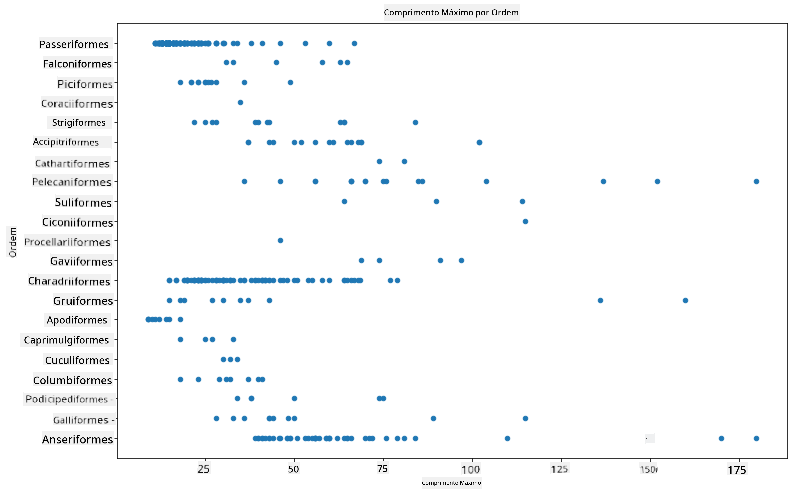
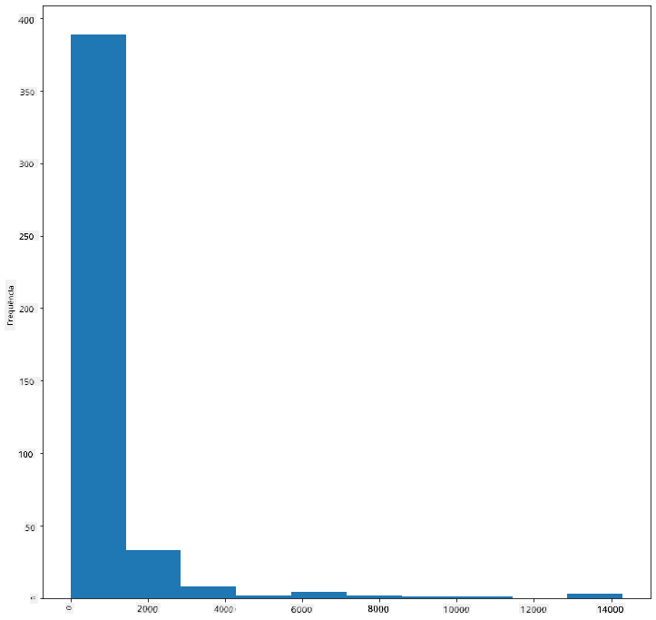
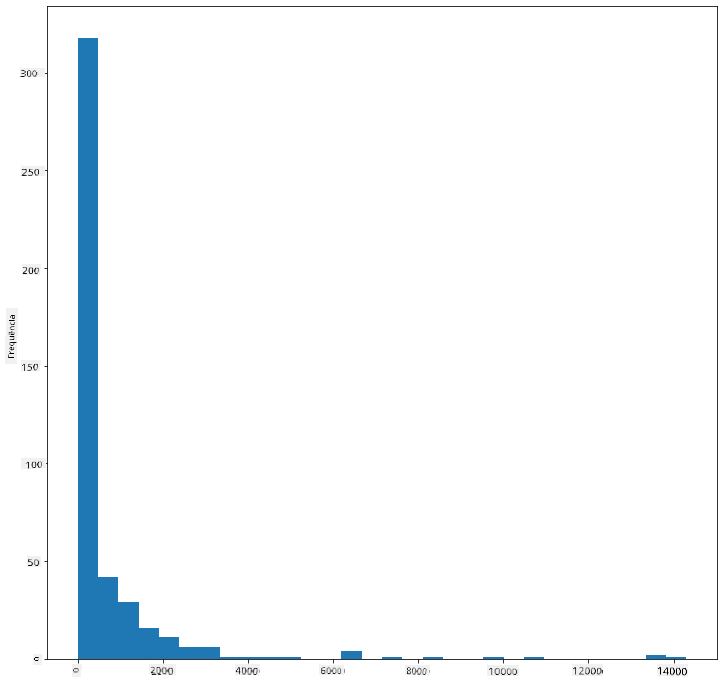
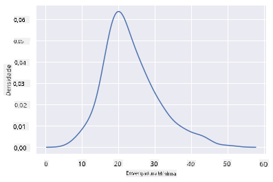
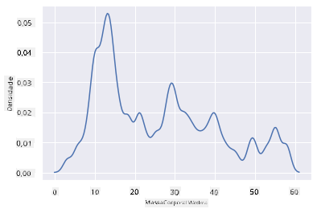
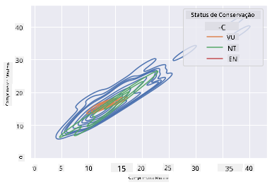

<!--
CO_OP_TRANSLATOR_METADATA:
{
  "original_hash": "87faccac113d772551486a67a607153e",
  "translation_date": "2025-08-27T18:18:30+00:00",
  "source_file": "3-Data-Visualization/10-visualization-distributions/README.md",
  "language_code": "br"
}
-->
# Visualizando Distribuições

| ](../../sketchnotes/10-Visualizing-Distributions.png)|
|:---:|
| Visualizando Distribuições - _Sketchnote por [@nitya](https://twitter.com/nitya)_ |

Na lição anterior, você aprendeu alguns fatos interessantes sobre um conjunto de dados sobre as aves de Minnesota. Você encontrou alguns dados errôneos ao visualizar outliers e analisou as diferenças entre categorias de aves com base no comprimento máximo.

## [Quiz pré-aula](https://purple-hill-04aebfb03.1.azurestaticapps.net/quiz/18)
## Explore o conjunto de dados das aves

Outra maneira de explorar os dados é analisando sua distribuição, ou como os dados estão organizados ao longo de um eixo. Talvez, por exemplo, você queira aprender sobre a distribuição geral, neste conjunto de dados, da envergadura máxima ou da massa corporal máxima das aves de Minnesota.

Vamos descobrir alguns fatos sobre as distribuições de dados neste conjunto de dados. No arquivo _notebook.ipynb_ na raiz desta pasta de lição, importe Pandas, Matplotlib e seus dados:

```python
import pandas as pd
import matplotlib.pyplot as plt
birds = pd.read_csv('../../data/birds.csv')
birds.head()
```

|      | Nome                        | NomeCientífico         | Categoria             | Ordem        | Família  | Gênero      | StatusConservação  | ComprMin | ComprMax | MassaMin | MassaMax | EnvergMin | EnvergMax |
| ---: | :-------------------------- | :--------------------- | :-------------------- | :----------- | :------- | :---------- | :----------------- | --------: | --------: | ----------: | ----------: | ----------: | ----------: |
|    0 | Pato-assobiador-de-barriga-preta | Dendrocygna autumnalis | Patos/Gansos/AvesAquáticas | Anseriformes | Anatidae | Dendrocygna | LC                 |        47 |        56 |         652 |        1020 |          76 |          94 |
|    1 | Pato-assobiador-fulvo       | Dendrocygna bicolor    | Patos/Gansos/AvesAquáticas | Anseriformes | Anatidae | Dendrocygna | LC                 |        45 |        53 |         712 |        1050 |          85 |          93 |
|    2 | Ganso-das-neves             | Anser caerulescens     | Patos/Gansos/AvesAquáticas | Anseriformes | Anatidae | Anser       | LC                 |        64 |        79 |        2050 |        4050 |         135 |         165 |
|    3 | Ganso-de-Ross               | Anser rossii           | Patos/Gansos/AvesAquáticas | Anseriformes | Anatidae | Anser       | LC                 |      57.3 |        64 |        1066 |        1567 |         113 |         116 |
|    4 | Ganso-de-testa-branca-maior | Anser albifrons        | Patos/Gansos/AvesAquáticas | Anseriformes | Anatidae | Anser       | LC                 |        64 |        81 |        1930 |        3310 |         130 |         165 |

De forma geral, você pode rapidamente observar como os dados estão distribuídos usando um gráfico de dispersão, como fizemos na lição anterior:

```python
birds.plot(kind='scatter',x='MaxLength',y='Order',figsize=(12,8))

plt.title('Max Length per Order')
plt.ylabel('Order')
plt.xlabel('Max Length')

plt.show()
```


Isso fornece uma visão geral da distribuição do comprimento corporal por Ordem de aves, mas não é a maneira ideal de exibir distribuições reais. Essa tarefa geralmente é realizada criando um Histograma.

## Trabalhando com histogramas

O Matplotlib oferece ótimas maneiras de visualizar a distribuição de dados usando Histogramas. Esse tipo de gráfico é semelhante a um gráfico de barras, onde a distribuição pode ser vista pelo aumento e diminuição das barras. Para construir um histograma, você precisa de dados numéricos. Para criar um Histograma, você pode traçar um gráfico definindo o tipo como 'hist' para Histograma. Este gráfico mostra a distribuição de MaxBodyMass para o intervalo de dados numéricos de todo o conjunto de dados. Dividindo o array de dados em pequenos intervalos (bins), ele pode exibir a distribuição dos valores dos dados:

```python
birds['MaxBodyMass'].plot(kind = 'hist', bins = 10, figsize = (12,12))
plt.show()
```


Como você pode ver, a maioria das 400+ aves neste conjunto de dados está na faixa abaixo de 2000 para sua Massa Corporal Máxima. Obtenha mais insights sobre os dados alterando o parâmetro `bins` para um número maior, como 30:

```python
birds['MaxBodyMass'].plot(kind = 'hist', bins = 30, figsize = (12,12))
plt.show()
```


Este gráfico mostra a distribuição de forma um pouco mais detalhada. Um gráfico menos inclinado para a esquerda poderia ser criado garantindo que você selecione apenas dados dentro de um intervalo específico:

Filtre seus dados para obter apenas as aves cuja massa corporal seja inferior a 60 e mostre 40 `bins`:

```python
filteredBirds = birds[(birds['MaxBodyMass'] > 1) & (birds['MaxBodyMass'] < 60)]      
filteredBirds['MaxBodyMass'].plot(kind = 'hist',bins = 40,figsize = (12,12))
plt.show()     
```


✅ Experimente outros filtros e pontos de dados. Para ver a distribuição completa dos dados, remova o filtro `['MaxBodyMass']` para mostrar distribuições rotuladas.

O histograma oferece algumas melhorias interessantes de cor e rotulagem para experimentar também:

Crie um histograma 2D para comparar a relação entre duas distribuições. Vamos comparar `MaxBodyMass` com `MaxLength`. O Matplotlib oferece uma maneira integrada de mostrar convergência usando cores mais brilhantes:

```python
x = filteredBirds['MaxBodyMass']
y = filteredBirds['MaxLength']

fig, ax = plt.subplots(tight_layout=True)
hist = ax.hist2d(x, y)
```
Parece haver uma correlação esperada entre esses dois elementos ao longo de um eixo esperado, com um ponto de convergência particularmente forte:


Os histogramas funcionam bem por padrão para dados numéricos. E se você precisar ver distribuições de acordo com dados textuais? 

## Explore o conjunto de dados para distribuições usando dados textuais 

Este conjunto de dados também inclui boas informações sobre a categoria da ave, seu gênero, espécie e família, bem como seu status de conservação. Vamos explorar essas informações de conservação. Qual é a distribuição das aves de acordo com seu status de conservação?

> ✅ No conjunto de dados, vários acrônimos são usados para descrever o status de conservação. Esses acrônimos vêm das [Categorias da Lista Vermelha da IUCN](https://www.iucnredlist.org/), uma organização que cataloga o status das espécies.
> 
> - CR: Criticamente em Perigo
> - EN: Em Perigo
> - EX: Extinto
> - LC: Menor Preocupação
> - NT: Quase Ameaçado
> - VU: Vulnerável

Esses são valores baseados em texto, então você precisará fazer uma transformação para criar um histograma. Usando o dataframe filteredBirds, exiba seu status de conservação ao lado de sua Envergadura Mínima. O que você observa?

```python
x1 = filteredBirds.loc[filteredBirds.ConservationStatus=='EX', 'MinWingspan']
x2 = filteredBirds.loc[filteredBirds.ConservationStatus=='CR', 'MinWingspan']
x3 = filteredBirds.loc[filteredBirds.ConservationStatus=='EN', 'MinWingspan']
x4 = filteredBirds.loc[filteredBirds.ConservationStatus=='NT', 'MinWingspan']
x5 = filteredBirds.loc[filteredBirds.ConservationStatus=='VU', 'MinWingspan']
x6 = filteredBirds.loc[filteredBirds.ConservationStatus=='LC', 'MinWingspan']

kwargs = dict(alpha=0.5, bins=20)

plt.hist(x1, **kwargs, color='red', label='Extinct')
plt.hist(x2, **kwargs, color='orange', label='Critically Endangered')
plt.hist(x3, **kwargs, color='yellow', label='Endangered')
plt.hist(x4, **kwargs, color='green', label='Near Threatened')
plt.hist(x5, **kwargs, color='blue', label='Vulnerable')
plt.hist(x6, **kwargs, color='gray', label='Least Concern')

plt.gca().set(title='Conservation Status', ylabel='Min Wingspan')
plt.legend();
```


Não parece haver uma boa correlação entre a envergadura mínima e o status de conservação. Teste outros elementos do conjunto de dados usando este método. Você encontra alguma correlação?

## Gráficos de densidade

Você pode ter notado que os histogramas que analisamos até agora são 'escalonados' e não fluem suavemente em um arco. Para mostrar um gráfico de densidade mais suave, você pode tentar um gráfico de densidade.

Para trabalhar com gráficos de densidade, familiarize-se com uma nova biblioteca de gráficos, [Seaborn](https://seaborn.pydata.org/generated/seaborn.kdeplot.html). 

Carregando o Seaborn, experimente um gráfico de densidade básico:

```python
import seaborn as sns
import matplotlib.pyplot as plt
sns.kdeplot(filteredBirds['MinWingspan'])
plt.show()
```


Você pode ver como o gráfico reflete o anterior para os dados de Envergadura Mínima; ele é apenas um pouco mais suave. De acordo com a documentação do Seaborn, "Em relação a um histograma, o KDE pode produzir um gráfico menos confuso e mais interpretável, especialmente ao desenhar várias distribuições. Mas ele tem o potencial de introduzir distorções se a distribuição subjacente for limitada ou não for suave. Como um histograma, a qualidade da representação também depende da seleção de bons parâmetros de suavização." [fonte](https://seaborn.pydata.org/generated/seaborn.kdeplot.html) Em outras palavras, outliers, como sempre, farão com que seus gráficos se comportem mal.

Se você quisesse revisitar aquela linha irregular de MaxBodyMass no segundo gráfico que você criou, poderia suavizá-la muito bem recriando-a usando este método:

```python
sns.kdeplot(filteredBirds['MaxBodyMass'])
plt.show()
```


Se você quisesse uma linha suave, mas não muito suave, edite o parâmetro `bw_adjust`: 

```python
sns.kdeplot(filteredBirds['MaxBodyMass'], bw_adjust=.2)
plt.show()
```


✅ Leia sobre os parâmetros disponíveis para este tipo de gráfico e experimente!

Este tipo de gráfico oferece visualizações explicativas e bonitas. Com algumas linhas de código, por exemplo, você pode mostrar a densidade da massa corporal máxima por Ordem de aves:

```python
sns.kdeplot(
   data=filteredBirds, x="MaxBodyMass", hue="Order",
   fill=True, common_norm=False, palette="crest",
   alpha=.5, linewidth=0,
)
```


Você também pode mapear a densidade de várias variáveis em um único gráfico. Teste o Comprimento Máximo e o Comprimento Mínimo de uma ave em comparação com seu status de conservação:

```python
sns.kdeplot(data=filteredBirds, x="MinLength", y="MaxLength", hue="ConservationStatus")
```



Talvez valha a pena pesquisar se o agrupamento de aves 'Vulneráveis' de acordo com seus comprimentos é significativo ou não.

## 🚀 Desafio

Os histogramas são um tipo de gráfico mais sofisticado do que gráficos de dispersão, gráficos de barras ou gráficos de linhas básicos. Faça uma busca na internet para encontrar bons exemplos do uso de histogramas. Como eles são usados, o que demonstram e em quais campos ou áreas de estudo tendem a ser utilizados?

## [Quiz pós-aula](https://purple-hill-04aebfb03.1.azurestaticapps.net/quiz/19)

## Revisão e Autoestudo

Nesta lição, você usou o Matplotlib e começou a trabalhar com o Seaborn para criar gráficos mais sofisticados. Pesquise sobre `kdeplot` no Seaborn, uma "curva de densidade de probabilidade contínua em uma ou mais dimensões". Leia a [documentação](https://seaborn.pydata.org/generated/seaborn.kdeplot.html) para entender como funciona.

## Tarefa

[Coloque suas habilidades em prática](assignment.md)

---

**Aviso Legal**:  
Este documento foi traduzido utilizando o serviço de tradução por IA [Co-op Translator](https://github.com/Azure/co-op-translator). Embora nos esforcemos para garantir a precisão, esteja ciente de que traduções automatizadas podem conter erros ou imprecisões. O documento original em seu idioma nativo deve ser considerado a fonte autoritativa. Para informações críticas, recomenda-se a tradução profissional realizada por humanos. Não nos responsabilizamos por quaisquer mal-entendidos ou interpretações equivocadas decorrentes do uso desta tradução.