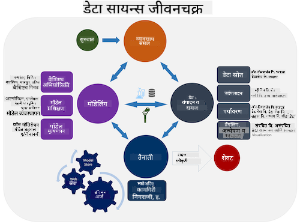
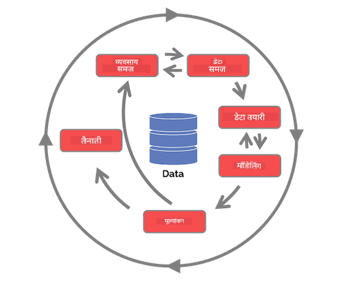

<!--
CO_OP_TRANSLATOR_METADATA:
{
  "original_hash": "c368f8f2506fe56bca0f7be05c4eb71d",
  "translation_date": "2025-08-27T17:56:44+00:00",
  "source_file": "4-Data-Science-Lifecycle/14-Introduction/README.md",
  "language_code": "mr"
}
-->
# डेटा सायन्स जीवनचक्राची ओळख

| ](../../sketchnotes/14-DataScience-Lifecycle.png)|
|:---:|
| डेटा सायन्स जीवनचक्राची ओळख - _Sketchnote by [@nitya](https://twitter.com/nitya)_ |

## [पूर्व-व्याख्यान क्विझ](https://red-water-0103e7a0f.azurestaticapps.net/quiz/26)

आत्तापर्यंत तुम्हाला कदाचित हे लक्षात आले असेल की डेटा सायन्स हा एक प्रक्रिया आहे. ही प्रक्रिया 5 टप्प्यांमध्ये विभागली जाऊ शकते:

- डेटा गोळा करणे
- प्रक्रिया करणे
- विश्लेषण
- संवाद साधणे
- देखभाल

या धड्यात जीवनचक्राच्या 3 भागांवर लक्ष केंद्रित केले आहे: डेटा गोळा करणे, प्रक्रिया करणे आणि देखभाल.

  
> फोटो [बर्कले स्कूल ऑफ इन्फॉर्मेशन](https://ischoolonline.berkeley.edu/data-science/what-is-data-science/) यांच्याकडून

## डेटा गोळा करणे

जीवनचक्राचा पहिला टप्पा खूप महत्त्वाचा आहे कारण पुढील टप्पे यावर अवलंबून असतात. हा टप्पा प्रत्यक्षात दोन टप्प्यांचा एकत्रित भाग आहे: डेटा मिळवणे आणि उद्दिष्टे व समस्यांचे परिभाषित करणे.  
प्रकल्पाचे उद्दिष्टे परिभाषित करण्यासाठी समस्येचा किंवा प्रश्नाचा सखोल संदर्भ आवश्यक आहे. प्रथम, ज्यांना त्यांची समस्या सोडवायची आहे त्यांना ओळखणे आणि त्यांच्याशी संपर्क साधणे आवश्यक आहे. हे व्यवसायातील भागधारक किंवा प्रकल्पाचे प्रायोजक असू शकतात, जे प्रकल्पाचा फायदा कोणाला होईल, काय आणि का याची ओळख पटवून देऊ शकतात. चांगले परिभाषित उद्दिष्ट मोजता येण्याजोगे आणि परिमाणात्मक असावे जेणेकरून स्वीकारार्ह परिणाम निश्चित करता येईल.

डेटा सायंटिस्ट विचारू शकणारे प्रश्न:
- ही समस्या यापूर्वी हाताळली गेली आहे का? काय शोधले गेले?
- उद्दिष्टे आणि हेतू सर्व संबंधितांना समजले आहेत का?
- काही संदिग्धता आहे का? ती कशी कमी करता येईल?
- मर्यादा काय आहेत?
- अंतिम परिणाम कसा दिसेल?
- किती संसाधने (वेळ, लोक, संगणकीय) उपलब्ध आहेत?

यानंतर, परिभाषित उद्दिष्टे साध्य करण्यासाठी आवश्यक डेटा ओळखणे, गोळा करणे आणि त्याचा अभ्यास करणे आवश्यक आहे. या टप्प्यावर, डेटा सायंटिस्टला डेटाची मात्रा आणि गुणवत्ता तपासावी लागते. यासाठी डेटा अन्वेषण आवश्यक आहे जेणेकरून गोळा केलेला डेटा इच्छित परिणाम साध्य करण्यास उपयुक्त ठरेल.

डेटाबाबत डेटा सायंटिस्ट विचारू शकणारे प्रश्न:
- माझ्याकडे आधीपासून कोणता डेटा उपलब्ध आहे?
- हा डेटा कोणाचा आहे?
- गोपनीयतेचे कोणते मुद्दे आहेत?
- ही समस्या सोडवण्यासाठी पुरेसा डेटा आहे का?
- या समस्येसाठी डेटा स्वीकारार्ह गुणवत्तेचा आहे का?
- जर या डेटामधून अतिरिक्त माहिती सापडली, तर उद्दिष्टे बदलण्याचा विचार करावा का?

## प्रक्रिया करणे

जीवनचक्राचा प्रक्रिया टप्पा डेटामधील पॅटर्न शोधणे आणि मॉडेलिंगवर लक्ष केंद्रित करतो. या टप्प्यातील काही तंत्रे सांख्यिकीय पद्धतींचा वापर करून पॅटर्न शोधण्यासाठी वापरली जातात. मोठ्या डेटासेटसाठी हे काम माणसासाठी खूप वेळखाऊ असते, त्यामुळे संगणकाचा वापर करून प्रक्रिया वेगवान केली जाते. या टप्प्यात डेटा सायन्स आणि मशीन लर्निंग यांचा संगम होतो. पहिल्या धड्यात शिकल्याप्रमाणे, मशीन लर्निंग म्हणजे डेटाचे आकलन करण्यासाठी मॉडेल तयार करणे. मॉडेल म्हणजे डेटामधील व्हेरिएबल्समधील संबंधांचे प्रतिनिधित्व, जे परिणामांचा अंदाज लावण्यास मदत करते.

या टप्प्यात वापरली जाणारी सामान्य तंत्रे ML for Beginners अभ्यासक्रमात समाविष्ट आहेत. त्याबद्दल अधिक जाणून घेण्यासाठी खालील दुवे पहा:

- [Classification](https://github.com/microsoft/ML-For-Beginners/tree/main/4-Classification): डेटाला अधिक कार्यक्षमतेने वापरण्यासाठी श्रेणींमध्ये वर्गीकृत करणे.
- [Clustering](https://github.com/microsoft/ML-For-Beginners/tree/main/5-Clustering): समान गटांमध्ये डेटा गटबद्ध करणे.
- [Regression](https://github.com/microsoft/ML-For-Beginners/tree/main/2-Regression): व्हेरिएबल्समधील संबंध ठरवून मूल्यांचा अंदाज किंवा पूर्वानुमान करणे.

## देखभाल

जीवनचक्राच्या आकृतीमध्ये, तुम्ही पाहिले असेल की देखभाल हा टप्पा डेटा गोळा करणे आणि प्रक्रिया करणे यामध्ये आहे. देखभाल म्हणजे प्रकल्पाच्या प्रक्रियेदरम्यान डेटा व्यवस्थापित करणे, साठवणे आणि सुरक्षित ठेवणे. ही प्रक्रिया प्रकल्पाच्या संपूर्ण कालावधीत विचारात घेतली पाहिजे.

### डेटा साठवणे

डेटा कसा आणि कुठे साठवायचा याचा विचार साठवणीच्या खर्चावर तसेच डेटा किती वेगाने प्रवेशयोग्य होईल यावर परिणाम करू शकतो. अशा निर्णयांमध्ये डेटा सायंटिस्ट एकटा निर्णय घेणार नाही, परंतु डेटा कसा साठवला जातो यावर आधारित काम करण्याच्या पद्धती निवडाव्या लागतील.

आधुनिक डेटा साठवण प्रणालींचे काही पैलू जे या निवडींवर परिणाम करू शकतात:

**ऑन-प्रिमाइसेस विरुद्ध ऑफ-प्रिमाइसेस विरुद्ध सार्वजनिक किंवा खाजगी क्लाउड**

ऑन-प्रिमाइसेस म्हणजे स्वतःच्या उपकरणांवर डेटा होस्ट करणे, जसे की सर्व्हर आणि हार्ड ड्राइव्ह्स, तर ऑफ-प्रिमाइसेस म्हणजे अशा उपकरणांवर अवलंबून राहणे जे तुमचे स्वतःचे नाहीत, जसे की डेटा सेंटर. सार्वजनिक क्लाउड ही डेटा साठवण्यासाठी एक लोकप्रिय निवड आहे, ज्यासाठी डेटा कसा आणि कुठे साठवला जातो याचे ज्ञान आवश्यक नाही. काही संस्थांमध्ये कडक सुरक्षा धोरणे असतात, ज्यामुळे त्यांना डेटा होस्ट करणाऱ्या उपकरणांवर पूर्ण प्रवेश आवश्यक असतो, आणि अशा वेळी खाजगी क्लाउडचा वापर केला जातो. तुम्ही [पुढील धड्यांमध्ये](https://github.com/microsoft/Data-Science-For-Beginners/tree/main/5-Data-Science-In-Cloud) क्लाउडमधील डेटाबद्दल अधिक शिकाल.

**कोल्ड विरुद्ध हॉट डेटा**

तुमच्या मॉडेल्सना प्रशिक्षण देताना तुम्हाला अधिक प्रशिक्षण डेटा लागेल. जर तुम्ही तुमच्या मॉडेलवर समाधानी असाल, तरीही त्याच्या उद्देशासाठी नवीन डेटा येत राहील. अशा परिस्थितीत डेटा साठवण्याचा आणि त्याचा प्रवेश करण्याचा खर्च वाढेल. क्वचितच वापरल्या जाणाऱ्या डेटाला (कोल्ड डेटा) वारंवार वापरल्या जाणाऱ्या डेटापासून (हॉट डेटा) वेगळे करणे हे हार्डवेअर किंवा सॉफ्टवेअर सेवांद्वारे स्वस्त साठवणीचा पर्याय ठरू शकते. कोल्ड डेटा प्रवेशासाठी थोडा अधिक वेळ लागू शकतो.

### डेटा व्यवस्थापन

डेटावर काम करताना तुम्हाला कदाचित असे आढळेल की काही डेटा स्वच्छ करणे आवश्यक आहे. [डेटा तयारी](https://github.com/microsoft/Data-Science-For-Beginners/tree/main/2-Working-With-Data/08-data-preparation) धड्यात समाविष्ट केलेल्या तंत्रांचा वापर करून अचूक मॉडेल तयार करण्यासाठी डेटा स्वच्छ केला जाऊ शकतो. नवीन डेटा आल्यावर त्याच गुणवत्तेची सुसंगतता राखण्यासाठी त्याच तंत्रांचा वापर करावा लागेल. काही प्रकल्पांमध्ये डेटा स्वच्छ करणे, एकत्र करणे आणि संक्षेप करणे यासाठी स्वयंचलित साधनांचा वापर केला जातो. Azure Data Factory हे अशा साधनांचे एक उदाहरण आहे.

### डेटा सुरक्षित ठेवणे

डेटा सुरक्षित ठेवण्याचे मुख्य उद्दिष्ट म्हणजे डेटा कसा गोळा केला जातो आणि कोणत्या संदर्भात वापरला जातो यावर नियंत्रण ठेवणे. डेटा सुरक्षित ठेवण्यासाठी फक्त गरज असलेल्या लोकांनाच प्रवेश देणे, स्थानिक कायदे आणि नियमांचे पालन करणे, तसेच नैतिक मानकांचे पालन करणे आवश्यक आहे. याबद्दल [नैतिकता धड्यात](https://github.com/microsoft/Data-Science-For-Beginners/tree/main/1-Introduction/02-ethics) अधिक माहिती दिली आहे.

सुरक्षेच्या दृष्टीने टीमकडून केले जाणारे काही उपाय:
- सर्व डेटा एन्क्रिप्ट केला आहे याची खात्री करणे
- ग्राहकांना त्यांच्या डेटाचा कसा वापर केला जातो याची माहिती देणे
- प्रकल्प सोडलेल्या व्यक्तींचा डेटा प्रवेश काढून टाकणे
- फक्त विशिष्ट प्रकल्प सदस्यांनाच डेटा बदलण्याची परवानगी देणे

## 🚀 आव्हान

डेटा सायन्स जीवनचक्राच्या अनेक आवृत्त्या आहेत, जिथे प्रत्येक टप्प्याला वेगवेगळी नावे आणि टप्प्यांची संख्या असू शकते, परंतु या धड्यात नमूद केलेल्या प्रक्रियांचा समावेश असेल.

[टीम डेटा सायन्स प्रक्रिया जीवनचक्र](https://docs.microsoft.com/en-us/azure/architecture/data-science-process/lifecycle) आणि [क्रॉस-इंडस्ट्री मानक प्रक्रिया डेटा माइनिंगसाठी](https://www.datascience-pm.com/crisp-dm-2/) यांचा अभ्यास करा. त्यामधील 3 साम्ये आणि फरक सांगा.

|टीम डेटा सायन्स प्रक्रिया (TDSP)|क्रॉस-इंडस्ट्री मानक प्रक्रिया डेटा माइनिंगसाठी (CRISP-DM)|
|--|--|
| |  |
| प्रतिमा [Microsoft](https://docs.microsoft.comazure/architecture/data-science-process/lifecycle) यांच्याकडून | प्रतिमा [डेटा सायन्स प्रक्रिया अलायन्स](https://www.datascience-pm.com/crisp-dm-2/) यांच्याकडून |

## [व्याख्यानानंतरचा क्विझ](https://red-water-0103e7a0f.azurestaticapps.net/quiz/27)

## पुनरावलोकन आणि स्व-अभ्यास

डेटा सायन्स जीवनचक्र लागू करणे यामध्ये अनेक भूमिका आणि कार्ये समाविष्ट असतात, जिथे काही विशिष्ट टप्प्यांवर लक्ष केंद्रित करतात. टीम डेटा सायन्स प्रक्रिया प्रकल्पामध्ये कोणत्या प्रकारच्या भूमिका आणि कार्ये असू शकतात याबद्दल काही संसाधने प्रदान करते.

* [टीम डेटा सायन्स प्रक्रिया भूमिका आणि कार्ये](https://docs.microsoft.com/en-us/azure/architecture/data-science-process/roles-tasks)  
* [डेटा सायन्स कार्ये अंमलात आणा: अन्वेषण, मॉडेलिंग, आणि तैनात करणे](https://docs.microsoft.com/en-us/azure/architecture/data-science-process/execute-data-science-tasks)

## असाइनमेंट

[डेटासेटचे मूल्यांकन करणे](assignment.md)

---

**अस्वीकरण**:  
हा दस्तऐवज AI भाषांतर सेवा [Co-op Translator](https://github.com/Azure/co-op-translator) वापरून भाषांतरित करण्यात आला आहे. आम्ही अचूकतेसाठी प्रयत्नशील असलो तरी, कृपया लक्षात ठेवा की स्वयंचलित भाषांतरे त्रुटी किंवा अचूकतेच्या अभावाने युक्त असू शकतात. मूळ भाषेतील दस्तऐवज हा अधिकृत स्रोत मानला जावा. महत्त्वाच्या माहितीसाठी, व्यावसायिक मानवी भाषांतराची शिफारस केली जाते. या भाषांतराचा वापर करून उद्भवलेल्या कोणत्याही गैरसमज किंवा चुकीच्या अर्थासाठी आम्ही जबाबदार राहणार नाही.