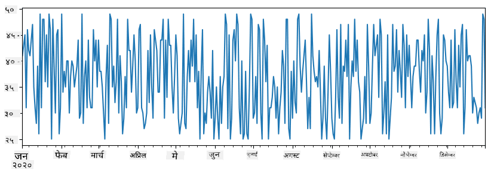
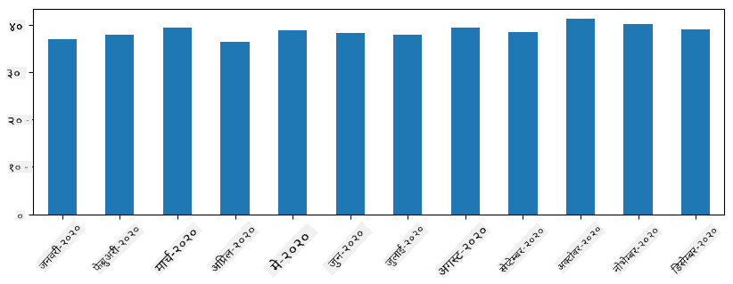
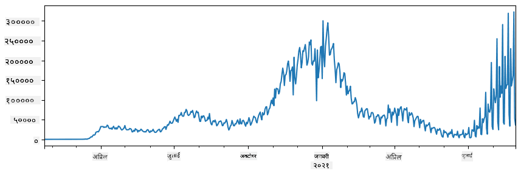

<!--
CO_OP_TRANSLATOR_METADATA:
{
  "original_hash": "116c5d361fbe812e59a73f37ce721d36",
  "translation_date": "2025-08-27T16:51:35+00:00",
  "source_file": "2-Working-With-Data/07-python/README.md",
  "language_code": "ne"
}
-->
# डाटा संग काम गर्ने: पाइथन र प्यान्डास लाइब्रेरी

|  ](../../sketchnotes/07-WorkWithPython.png) |
| :-------------------------------------------------------------------------------------------------------: |
|                 पाइथन संग काम गर्ने - _Sketchnote by [@nitya](https://twitter.com/nitya)_                 |

[](https://youtu.be/dZjWOGbsN4Y)

डाटाबेसहरूले डाटा भण्डारण गर्न र क्वेरी भाषाहरू प्रयोग गरेर तिनीहरूलाई सोधपुछ गर्न धेरै प्रभावकारी तरिका प्रदान गर्छन्। तर, डाटा प्रशोधनको सबैभन्दा लचिलो तरिका भनेको आफ्नो प्रोग्राम लेखेर डाटालाई हेरफेर गर्नु हो। धेरै अवस्थामा, डाटाबेस क्वेरी गर्नु अझ प्रभावकारी हुन्छ। तर, कहिलेकाहीँ जटिल डाटा प्रशोधन आवश्यक पर्दा, SQL प्रयोग गरेर सजिलै गर्न सकिँदैन। 
डाटा प्रशोधन कुनै पनि प्रोग्रामिङ भाषामा गर्न सकिन्छ, तर केही भाषाहरू डाटासँग काम गर्न उच्च स्तरका हुन्छन्। डाटा वैज्ञानिकहरूले प्रायः निम्न भाषाहरू प्रयोग गर्न रुचाउँछन्:

* **[Python](https://www.python.org/)**, एक सामान्य-उद्देश्यीय प्रोग्रामिङ भाषा, जसलाई यसको सरलताका कारण प्रायः सुरुवातकर्ताहरूका लागि उत्कृष्ट विकल्प मानिन्छ। पाइथनसँग धेरै अतिरिक्त लाइब्रेरीहरू छन् जसले तपाईंलाई व्यावहारिक समस्याहरू समाधान गर्न मद्दत गर्न सक्छ, जस्तै ZIP आर्काइभबाट डाटा निकाल्ने, वा तस्बिरलाई ग्रेस्केलमा रूपान्तरण गर्ने। डाटा विज्ञान बाहेक, पाइथन वेब विकासका लागि पनि प्रायः प्रयोग गरिन्छ। 
* **[R](https://www.r-project.org/)**, एक परम्परागत उपकरण हो, जुन सांख्यिकीय डाटा प्रशोधनको लागि विकास गरिएको हो। यसमा ठूलो लाइब्रेरी भण्डार (CRAN) छ, जसले यसलाई डाटा प्रशोधनको लागि राम्रो विकल्प बनाउँछ। तर, R सामान्य-उद्देश्यीय प्रोग्रामिङ भाषा होइन, र डाटा विज्ञान क्षेत्र बाहिर कमै प्रयोग गरिन्छ।
* **[Julia](https://julialang.org/)**, अर्को भाषा हो, जुन विशेष गरी डाटा विज्ञानको लागि विकास गरिएको हो। यसले पाइथनभन्दा राम्रो प्रदर्शन दिनको लागि बनाइएको हो, जसले यसलाई वैज्ञानिक प्रयोगका लागि उत्कृष्ट उपकरण बनाउँछ।

यस पाठमा, हामी पाइथन प्रयोग गरेर साधारण डाटा प्रशोधनमा केन्द्रित हुनेछौं। हामीले भाषाको आधारभूत परिचय भएको मान्नेछौं। यदि तपाईंलाई पाइथनको गहिरो अध्ययन गर्न मन छ भने, निम्न स्रोतहरू हेर्न सक्नुहुन्छ:

* [Learn Python in a Fun Way with Turtle Graphics and Fractals](https://github.com/shwars/pycourse) - पाइथन प्रोग्रामिङको लागि GitHub-आधारित छोटो परिचयात्मक पाठ
* [Take your First Steps with Python](https://docs.microsoft.com/en-us/learn/paths/python-first-steps/?WT.mc_id=academic-77958-bethanycheum) [Microsoft Learn](http://learn.microsoft.com/?WT.mc_id=academic-77958-bethanycheum) मा उपलब्ध लर्निङ पाथ

डाटा धेरै प्रकारका हुन सक्छ। यस पाठमा, हामी तीन प्रकारका डाटालाई विचार गर्नेछौं - **तालिकात्मक डाटा**, **पाठ** र **तस्बिरहरू**।

हामी सबै सम्बन्धित लाइब्रेरीहरूको पूर्ण अवलोकन दिनुको सट्टा, डाटा प्रशोधनका केही उदाहरणहरूमा केन्द्रित हुनेछौं। यसले तपाईंलाई के सम्भव छ भन्ने मुख्य विचार दिन्छ, र तपाईंलाई आवश्यक पर्दा समाधानहरू कहाँ फेला पार्ने भन्ने बुझाइ दिन्छ।

> **सबैभन्दा उपयोगी सल्लाह**। जब तपाईंलाई डाटामा कुनै निश्चित अपरेशन गर्न आवश्यक पर्छ, तर तपाईंलाई कसरी गर्ने थाहा छैन, इन्टरनेटमा खोज्ने प्रयास गर्नुहोस्। [Stackoverflow](https://stackoverflow.com/) मा पाइथनका धेरै सामान्य कार्यहरूको लागि उपयोगी कोड नमूनाहरू पाइन्छ। 

## [पाठ अघि क्विज](https://purple-hill-04aebfb03.1.azurestaticapps.net/quiz/12)

## तालिकात्मक डाटा र डाटाफ्रेमहरू

तपाईंले तालिकात्मक डाटासँग पहिले नै भेट गर्नुभएको छ, जब हामीले सम्बन्धित डाटाबेसहरूको बारेमा कुरा गर्यौं। जब तपाईंसँग धेरै डाटा हुन्छ, र यो धेरै फरक-फरक तालिकाहरूमा जोडिएको हुन्छ, SQL प्रयोग गरेर काम गर्नु उपयुक्त हुन्छ। तर, धेरै अवस्थामा, हामीसँग एउटा तालिका हुन्छ, र हामीले यस डाटाको बारेमा केही **बुझाइ** वा **अन्तर्दृष्टि** प्राप्त गर्न आवश्यक पर्छ, जस्तै वितरण, मानहरू बीचको सम्बन्ध, आदि। डाटा विज्ञानमा, धेरै अवस्थामा, हामीले मूल डाटाको केही रूपान्तरण गर्न आवश्यक पर्छ, त्यसपछि भिजुअलाइजेसन। यी दुवै चरणहरू पाइथन प्रयोग गरेर सजिलै गर्न सकिन्छ।

पाइथनमा तालिकात्मक डाटासँग काम गर्न मद्दत गर्ने दुई सबैभन्दा उपयोगी लाइब्रेरीहरू छन्:
* **[Pandas](https://pandas.pydata.org/)**, जसले तथाकथित **डाटाफ्रेमहरू** हेरफेर गर्न अनुमति दिन्छ, जुन सम्बन्धित तालिकाहरूको समानान्तर हुन्छ। तपाईंले नामित स्तम्भहरू राख्न सक्नुहुन्छ, र पङ्क्ति, स्तम्भ र डाटाफ्रेमहरूमा विभिन्न अपरेशनहरू गर्न सक्नुहुन्छ। 
* **[Numpy](https://numpy.org/)**, **टेन्सरहरू**, अर्थात् बहु-आयामिक **एरेहरू**सँग काम गर्नको लागि लाइब्रेरी हो। एरेमा एउटै आधारभूत प्रकारका मानहरू हुन्छन्, र यो डाटाफ्रेमभन्दा सरल हुन्छ, तर यसले बढी गणितीय अपरेशनहरू प्रदान गर्दछ, र कम ओभरहेड सिर्जना गर्दछ।

त्यसैगरी, तपाईंले जान्नुपर्ने अन्य केही लाइब्रेरीहरू छन्:
* **[Matplotlib](https://matplotlib.org/)**, डाटा भिजुअलाइजेसन र ग्राफहरू बनाउने लाइब्रेरी हो
* **[SciPy](https://www.scipy.org/)**, केही अतिरिक्त वैज्ञानिक कार्यहरू भएको लाइब्रेरी हो। हामीले यस लाइब्रेरीलाई सम्भाव्यता र तथ्यांकको बारेमा कुरा गर्दा पहिले नै भेट गरेका छौं।

यहाँ एउटा कोडको टुक्रा छ, जुन तपाईंले आफ्नो पाइथन प्रोग्रामको सुरुवातमा यी लाइब्रेरीहरू आयात गर्न प्रयोग गर्नुहुनेछ:
```python
import numpy as np
import pandas as pd
import matplotlib.pyplot as plt
from scipy import ... # you need to specify exact sub-packages that you need
``` 

प्यान्डास केही आधारभूत अवधारणाहरू वरिपरि केन्द्रित छ।

### सिरिज 

**सिरिज** भनेको मानहरूको अनुक्रम हो, जुन सूची वा नम्पाइ एरेसँग मिल्दोजुल्दो हुन्छ। मुख्य भिन्नता भनेको सिरिजसँग **इन्डेक्स** पनि हुन्छ, र जब हामी सिरिजमा अपरेशन गर्छौं (जस्तै, तिनीहरूलाई जोड्छौं), इन्डेक्सलाई ध्यानमा राखिन्छ। इन्डेक्स साधारण पूर्णांक पङ्क्ति नम्बर (सूची वा एरेबाट सिरिज बनाउँदा प्रयोग गरिने डिफल्ट इन्डेक्स) जत्तिकै सरल हुन सक्छ, वा यसले जटिल संरचना, जस्तै मिति अन्तराल, लिन सक्छ।

> **नोट**: प्यान्डासको केही प्रारम्भिक कोड संग्लग्न नोटबुक [`notebook.ipynb`](notebook.ipynb) मा छ। हामी यहाँ केही उदाहरणहरू मात्र उल्लेख गर्छौं, र तपाईंलाई पूर्ण नोटबुक हेर्न स्वागत छ।

उदाहरणको रूपमा विचार गर्नुहोस्: हामी हाम्रो आइसक्रिम पसलको बिक्री विश्लेषण गर्न चाहन्छौं। केही समय अवधिको लागि बिक्री सङ्ख्याहरू (प्रत्येक दिन बेचिएका वस्तुहरूको सङ्ख्या) को सिरिज उत्पन्न गरौं:

```python
start_date = "Jan 1, 2020"
end_date = "Mar 31, 2020"
idx = pd.date_range(start_date,end_date)
print(f"Length of index is {len(idx)}")
items_sold = pd.Series(np.random.randint(25,50,size=len(idx)),index=idx)
items_sold.plot()
```


अब कल्पना गर्नुहोस् कि प्रत्येक हप्ता हामी साथीहरूको लागि पार्टी आयोजना गर्छौं, र पार्टीको लागि १० प्याक आइसक्रिम थप्छौं। हामी अर्को सिरिज बनाउन सक्छौं, हप्ताद्वारा इन्डेक्स गरिएको, यो देखाउन:
```python
additional_items = pd.Series(10,index=pd.date_range(start_date,end_date,freq="W"))
```
जब हामी दुई सिरिजलाई सँगै जोड्छौं, हामी कुल सङ्ख्या पाउँछौं:
```python
total_items = items_sold.add(additional_items,fill_value=0)
total_items.plot()
```


> **नोट** कि हामीले साधारण `total_items+additional_items` सिन्ट्याक्स प्रयोग गरेका छैनौं। यदि हामीले त्यसो गरेका भए, हामीले परिणामस्वरूप धेरै `NaN` (*Not a Number*) मानहरू पाउने थियौं। यो किनभने `additional_items` सिरिजमा केही इन्डेक्स बिन्दुहरूको लागि मानहरू हराइरहेका छन्, र `NaN` लाई कुनै पनि चीजमा जोड्दा `NaN` परिणाम दिन्छ। त्यसैले हामीले थप गर्दा `fill_value` प्यारामिटर निर्दिष्ट गर्न आवश्यक छ।

समय सिरिजको साथ, हामी फरक समय अन्तरालहरूसँग सिरिजलाई **पुनःनमूना** गर्न सक्छौं। उदाहरणका लागि, मानौं हामी मासिक औसत बिक्री मात्रा गणना गर्न चाहन्छौं। हामी निम्न कोड प्रयोग गर्न सक्छौं:
```python
monthly = total_items.resample("1M").mean()
ax = monthly.plot(kind='bar')
```


### डाटाफ्रेम

डाटाफ्रेम भनेको मूलतः एउटै इन्डेक्स भएका सिरिजहरूको सङ्ग्रह हो। हामी धेरै सिरिजहरूलाई सँगै डाटाफ्रेममा संयोजन गर्न सक्छौं:
```python
a = pd.Series(range(1,10))
b = pd.Series(["I","like","to","play","games","and","will","not","change"],index=range(0,9))
df = pd.DataFrame([a,b])
```
यसले यस्तो क्षैतिज तालिका बनाउँछ:
|     | 0   | 1    | 2   | 3   | 4      | 5   | 6      | 7    | 8    |
| --- | --- | ---- | --- | --- | ------ | --- | ------ | ---- | ---- |
| 0   | 1   | 2    | 3   | 4   | 5      | 6   | 7      | 8    | 9    |
| 1   | I   | like | to  | use | Python | and | Pandas | very | much |

हामी सिरिजलाई स्तम्भको रूपमा पनि प्रयोग गर्न सक्छौं, र डिक्सनरी प्रयोग गरेर स्तम्भ नाम निर्दिष्ट गर्न सक्छौं:
```python
df = pd.DataFrame({ 'A' : a, 'B' : b })
```
यसले हामीलाई यस्तो तालिका दिन्छ:

|     | A   | B      |
| --- | --- | ------ |
| 0   | 1   | I      |
| 1   | 2   | like   |
| 2   | 3   | to     |
| 3   | 4   | use    |
| 4   | 5   | Python |
| 5   | 6   | and    |
| 6   | 7   | Pandas |
| 7   | 8   | very   |
| 8   | 9   | much   |

**नोट** कि हामीले यो तालिका लेआउटलाई अघिल्लो तालिकालाई ट्रान्सपोज गरेर पनि प्राप्त गर्न सक्छौं, जस्तै 
```python
df = pd.DataFrame([a,b]).T..rename(columns={ 0 : 'A', 1 : 'B' })
```
यहाँ `.T` ले डाटाफ्रेमलाई ट्रान्सपोज गर्ने अपरेशनलाई जनाउँछ, अर्थात् पङ्क्ति र स्तम्भहरू परिवर्तन गर्ने, र `rename` अपरेशनले स्तम्भहरूलाई अघिल्लो उदाहरणसँग मिलाउन नाम परिवर्तन गर्न अनुमति दिन्छ।

डाटाफ्रेमहरूमा हामीले गर्न सक्ने केही सबैभन्दा महत्त्वपूर्ण अपरेशनहरू यहाँ छन्:

**स्तम्भ चयन**। हामी `df['A']` लेखेर व्यक्तिगत स्तम्भहरू चयन गर्न सक्छौं - यो अपरेशनले सिरिज फर्काउँछ। हामी `df[['B','A']]` लेखेर अर्को डाटाफ्रेममा स्तम्भहरूको उपसमूह चयन गर्न सक्छौं - यसले अर्को डाटाफ्रेम फर्काउँछ।

**केवल निश्चित पङ्क्तिहरू फिल्टर गर्ने**। उदाहरणका लागि, स्तम्भ `A` ५ भन्दा ठूलो भएका पङ्क्तिहरू मात्र राख्न, हामी `df[df['A']>5]` लेख्न सक्छौं।

> **नोट**: फिल्टरिङ्गले काम गर्ने तरिका यस्तो छ। `df['A']<5` अभिव्यक्तिले बूलियन सिरिज फर्काउँछ, जसले मूल सिरिज `df['A']` को प्रत्येक तत्त्वको लागि अभिव्यक्ति `True` वा `False` छ कि छैन भनेर जनाउँछ। जब बूलियन सिरिजलाई इन्डेक्सको रूपमा प्रयोग गरिन्छ, यसले डाटाफ्रेममा पङ्क्तिहरूको उपसमूह फर्काउँछ। त्यसैले मनपर्ने पाइथन बूलियन अभिव्यक्ति प्रयोग गर्न सम्भव छैन, उदाहरणका लागि, `df[df['A']>5 and df['A']<7]` लेख्नु गलत हुनेछ। यसको सट्टा, तपाईंले बूलियन सिरिजमा विशेष `&` अपरेशन प्रयोग गर्नुपर्छ, जस्तै `df[(df['A']>5) & (df['A']<7)]` (*ब्र्याकेटहरू यहाँ महत्त्वपूर्ण छन्*)।

**नयाँ गणनायोग्य स्तम्भहरू सिर्जना गर्ने**। हामी हाम्रो डाटाफ्रेमको लागि नयाँ गणनायोग्य स्तम्भहरू सहज अभिव्यक्ति प्रयोग गरेर सजिलै सिर्जना गर्न सक्छौं:
```python
df['DivA'] = df['A']-df['A'].mean() 
``` 
यो उदाहरणले A को यसको औसत मानबाट विचलन गणना गर्दछ। यहाँ वास्तवमा के हुन्छ भने हामी एउटा सिरिज गणना गर्छौं, र त्यसपछि यस सिरिजलाई बायाँपट्टि-हातको-पक्षमा असाइन गर्छौं, अर्को स्तम्भ सिर्जना गर्दै। त्यसैले, हामी कुनै पनि अपरेशनहरू प्रयोग गर्न सक्दैनौं जुन सिरिजसँग उपयुक्त छैन, उदाहरणका लागि, तलको कोड गलत छ:
```python
# Wrong code -> df['ADescr'] = "Low" if df['A'] < 5 else "Hi"
df['LenB'] = len(df['B']) # <- Wrong result
``` 
पछिल्लो उदाहरण, जबकि वाक्यविन्यासमा सही छ, हामीलाई गलत परिणाम दिन्छ, किनभने यसले स्तम्भमा सिरिज `B` को लम्बाइलाई सबै मानहरूमा असाइन गर्दछ, र हामीले चाहेको व्यक्तिगत तत्त्वहरूको लम्बाइ होइन।

यदि हामीलाई यस्तो जटिल अभिव्यक्तिहरू गणना गर्न आवश्यक छ भने, हामी `apply` फङ्क्सन प्रयोग गर्न सक्छौं। अन्तिम उदाहरणलाई निम्नानुसार लेख्न सकिन्छ:
```python
df['LenB'] = df['B'].apply(lambda x : len(x))
# or 
df['LenB'] = df['B'].apply(len)
```

माथिका अपरेशनहरू पछि, हामीसँग निम्न डाटाफ्रेम हुनेछ:

|     | A   | B      | DivA | LenB |
| --- | --- | ------ | ---- | ---- |
| 0   | 1   | I      | -4.0 | 1    |
| 1   | 2   | like   | -3.0 | 4    |
| 2   | 3   | to     | -2.0 | 2    |
| 3   | 4   | use    | -1.0 | 3    |
| 4   | 5   | Python | 0.0  | 6    |
| 5   | 6   | and    | 1.0  | 3    |
| 6   | 7   | Pandas | 2.0  | 6    |
| 7   | 8   | very   | 3.0  | 4    |
| 8   | 9   | much   | 4.0  | 4    |

**संख्याको आधारमा पङ्क्तिहरू चयन गर्ने** `iloc` संरचना प्रयोग गरेर गर्न सकिन्छ। उदाहरणका लागि, डाटाफ्रेमबाट पहिलो ५ पङ्क्तिहरू चयन गर्न:
```python
df.iloc[:5]
```

**समूह बनाउने** प्रायः *पिभट तालिकाहरू* जस्तै परिणाम प्राप्त गर्न प्रयोग गरिन्छ। मानौं हामी `LenB` को प्रत्येक दिइएको सङ्ख्याको लागि स्तम्भ `A` को औसत मान गणना गर्न चाहन्छौं। त्यसपछि हामी हाम्रो डाटाफ्रेमलाई `LenB` द्वारा समूहबद्ध गर्न सक्छौं, र `mean` कल गर्न सक्छौं:
```python
df.groupby(by='LenB').mean()
```
यदि हामीलाई समूहमा औसत र तत्त्वहरूको सङ्ख्या गणना गर्न आवश्यक छ भने, हामी थप जटिल `aggregate` फङ्क्सन प्रयोग गर्न सक्छौं:
```python
df.groupby(by='LenB') \
 .aggregate({ 'DivA' : len, 'A' : lambda x: x.mean() }) \
 .rename(columns={ 'DivA' : 'Count', 'A' : 'Mean'})
```
यसले हामीलाई निम्न तालिका दिन्छ:

| LenB | Count | Mean     |
| ---- | ----- | -------- |
| 1    | 1     | 1.000000 |
| 2    | 1     | 3.000000 |
| 3    | 2     | 5.000000 |
| 4    | 3     | 6.333333 |
| 6    | 2     | 6.000000 |

### डाटा प्राप्त गर्दै
हामीले देख्यौं कि Python वस्तुहरूबाट Series र DataFrames निर्माण गर्न कति सजिलो छ। तर, डाटा प्रायः पाठ फाइल वा Excel तालिकाको रूपमा आउँछ। सौभाग्यवश, Pandas ले हामीलाई डिस्कबाट डाटा लोड गर्न सजिलो तरिका प्रदान गर्दछ। उदाहरणका लागि, CSV फाइल पढ्न यति सजिलो छ:
```python
df = pd.read_csv('file.csv')
```
हामी "Challenge" खण्डमा बाह्य वेबसाइटहरूबाट डाटा ल्याउने सहित लोड गर्ने थप उदाहरणहरू हेर्नेछौं।

### प्रिन्टिङ र प्लटिङ

एक Data Scientist ले प्रायः डाटालाई अन्वेषण गर्नुपर्छ, त्यसैले यसलाई दृश्यात्मक बनाउन सक्षम हुनु महत्त्वपूर्ण छ। जब DataFrame ठूलो हुन्छ, धेरै पटक हामी केवल सुनिश्चित गर्न चाहन्छौं कि हामी सबै कुरा सही गरिरहेका छौं, त्यसका लागि पहिलो केही पङ्क्तिहरू प्रिन्ट गर्न चाहन्छौं। यो `df.head()` कल गरेर गर्न सकिन्छ। यदि तपाईंले यो Jupyter Notebook बाट चलाउनु भयो भने, यो DataFrame लाई राम्रो टेबलको रूपमा प्रिन्ट गर्नेछ।

हामीले `plot` फङ्क्शनको प्रयोग गरेर केही स्तम्भहरूलाई दृश्यात्मक बनाउने कुरा पनि देखेका छौं। जबकि `plot` धेरै कार्यहरूको लागि उपयोगी छ, र `kind=` प्यारामिटर मार्फत विभिन्न प्रकारका ग्राफहरू समर्थन गर्दछ, तपाईं सधैं कच्चा `matplotlib` लाइब्रेरी प्रयोग गरेर थप जटिल कुरा प्लट गर्न सक्नुहुन्छ। हामी अलग पाठहरूमा डाटा दृश्यात्मकता विस्तारमा कभर गर्नेछौं।

यो अवलोकनले Pandas का सबैभन्दा महत्त्वपूर्ण अवधारणाहरू समेट्छ, तर लाइब्रेरी धेरै समृद्ध छ, र तपाईंले यसबाट गर्न सक्ने कुराको कुनै सीमा छैन! अब हामी यो ज्ञानलाई विशिष्ट समस्याहरू समाधान गर्न प्रयोग गरौं।

## 🚀 Challenge 1: COVID फैलावटको विश्लेषण

पहिलो समस्या जसमा हामी केन्द्रित हुनेछौं, COVID-19 को महामारी फैलावटको मोडेलिङ हो। यसका लागि, हामी विभिन्न देशहरूमा संक्रमित व्यक्तिहरूको संख्या सम्बन्धी डाटा प्रयोग गर्नेछौं, जुन [Center for Systems Science and Engineering](https://systems.jhu.edu/) (CSSE) द्वारा [Johns Hopkins University](https://jhu.edu/) मा प्रदान गरिएको छ। डाटासेट [यस GitHub Repository](https://github.com/CSSEGISandData/COVID-19) मा उपलब्ध छ।

हामीले डाटासँग कसरी व्यवहार गर्ने देखाउन चाहन्छौं, त्यसैले कृपया [`notebook-covidspread.ipynb`](notebook-covidspread.ipynb) खोल्नुहोस् र माथिदेखि तलसम्म पढ्नुहोस्। तपाईंले सेलहरू चलाउन सक्नुहुन्छ, र अन्त्यमा हामीले छोडेका केही चुनौतीहरू गर्न सक्नुहुन्छ।



> यदि तपाईंलाई Jupyter Notebook मा कोड कसरी चलाउने थाहा छैन भने, [यस लेख](https://soshnikov.com/education/how-to-execute-notebooks-from-github/) हेर्नुहोस्।

## असंरचित डाटासँग काम गर्ने

डाटा प्रायः तालिकाको रूपमा आउँछ, तर केही अवस्थामा हामी कम संरचित डाटासँग व्यवहार गर्नुपर्छ, जस्तै पाठ वा छविहरू। यस अवस्थामा, माथि देखिएका डाटा प्रशोधन प्रविधिहरू लागू गर्न, हामीले कुनै प्रकारको **संरचित डाटा निकाल्न** आवश्यक छ। यहाँ केही उदाहरणहरू छन्:

* पाठबाट मुख्य शब्दहरू निकाल्ने, र ती शब्दहरू कति पटक देखा पर्छन् हेर्ने
* तस्बिरमा वस्तुहरूको बारेमा जानकारी निकाल्न न्युरल नेटवर्क प्रयोग गर्ने
* भिडियो क्यामेरा फिडमा व्यक्तिहरूको भावनाको जानकारी प्राप्त गर्ने

## 🚀 Challenge 2: COVID कागजातहरूको विश्लेषण

यस चुनौतीमा, हामी COVID महामारीको विषयलाई जारी राख्नेछौं, र यस विषयमा वैज्ञानिक कागजातहरूको प्रशोधनमा केन्द्रित हुनेछौं। [CORD-19 Dataset](https://www.kaggle.com/allen-institute-for-ai/CORD-19-research-challenge) मा 7000 भन्दा बढी (लेखनको समयमा) COVID सम्बन्धी कागजातहरू उपलब्ध छन्, जसमा मेटाडाटा र सारांशहरू छन् (र तिनीहरूमध्ये लगभग आधामा पूर्ण पाठ पनि प्रदान गरिएको छ)।

[Text Analytics for Health](https://docs.microsoft.com/azure/cognitive-services/text-analytics/how-tos/text-analytics-for-health/?WT.mc_id=academic-77958-bethanycheum) कग्निटिभ सेवाको प्रयोग गरेर यस डाटासेटको विश्लेषणको पूर्ण उदाहरण [यस ब्लग पोस्ट](https://soshnikov.com/science/analyzing-medical-papers-with-azure-and-text-analytics-for-health/) मा वर्णन गरिएको छ। हामी यस विश्लेषणको सरल संस्करण छलफल गर्नेछौं।

> **NOTE**: हामी यस रिपोजिटरीको भागको रूपमा डाटासेटको प्रतिलिपि प्रदान गर्दैनौं। तपाईंले पहिले [यस Kaggle डाटासेट](https://www.kaggle.com/allen-institute-for-ai/CORD-19-research-challenge?select=metadata.csv) बाट [`metadata.csv`](https://www.kaggle.com/allen-institute-for-ai/CORD-19-research-challenge?select=metadata.csv) फाइल डाउनलोड गर्न आवश्यक हुन सक्छ। Kaggle मा दर्ता आवश्यक हुन सक्छ। तपाईंले दर्ता बिना [यहाँबाट](https://ai2-semanticscholar-cord-19.s3-us-west-2.amazonaws.com/historical_releases.html) पनि डाटासेट डाउनलोड गर्न सक्नुहुन्छ, तर यसमा मेटाडाटा फाइलको अतिरिक्त सबै पूर्ण पाठहरू समावेश हुनेछ।

[`notebook-papers.ipynb`](notebook-papers.ipynb) खोल्नुहोस् र माथिदेखि तलसम्म पढ्नुहोस्। तपाईंले सेलहरू चलाउन सक्नुहुन्छ, र अन्त्यमा हामीले छोडेका केही चुनौतीहरू गर्न सक्नुहुन्छ।


## छवि डाटा प्रशोधन

हालसालै, धेरै शक्तिशाली AI मोडेलहरू विकास भएका छन् जसले छविहरूलाई बुझ्न अनुमति दिन्छ। धेरै कार्यहरू छन् जसलाई प्रि-ट्रेन गरिएको न्युरल नेटवर्कहरू वा क्लाउड सेवाहरू प्रयोग गरेर समाधान गर्न सकिन्छ। केही उदाहरणहरू समावेश छन्:

* **छवि वर्गीकरण**, जसले तपाईंलाई छविलाई पूर्व-परिभाषित वर्गहरू मध्ये एकमा वर्गीकृत गर्न मद्दत गर्न सक्छ। तपाईंले [Custom Vision](https://azure.microsoft.com/services/cognitive-services/custom-vision-service/?WT.mc_id=academic-77958-bethanycheum) जस्ता सेवाहरू प्रयोग गरेर सजिलै आफ्नै छवि वर्गीकरणकर्ता प्रशिक्षण गर्न सक्नुहुन्छ।
* **वस्तु पहिचान** छविमा विभिन्न वस्तुहरू पत्ता लगाउन। [Computer Vision](https://azure.microsoft.com/services/cognitive-services/computer-vision/?WT.mc_id=academic-77958-bethanycheum) जस्ता सेवाहरूले धेरै सामान्य वस्तुहरू पत्ता लगाउन सक्छन्, र तपाईंले [Custom Vision](https://azure.microsoft.com/services/cognitive-services/custom-vision-service/?WT.mc_id=academic-77958-bethanycheum) मोडेललाई केही विशिष्ट चासोका वस्तुहरू पत्ता लगाउन प्रशिक्षण गर्न सक्नुहुन्छ।
* **अनुहार पहिचान**, जसमा उमेर, लिङ्ग र भावना पहिचान समावेश छ। यो [Face API](https://azure.microsoft.com/services/cognitive-services/face/?WT.mc_id=academic-77958-bethanycheum) मार्फत गर्न सकिन्छ।

यी सबै क्लाउड सेवाहरू [Python SDKs](https://docs.microsoft.com/samples/azure-samples/cognitive-services-python-sdk-samples/cognitive-services-python-sdk-samples/?WT.mc_id=academic-77958-bethanycheum) प्रयोग गरेर कल गर्न सकिन्छ, र यसैले तपाईंको डाटा अन्वेषण कार्यप्रवाहमा सजिलै समावेश गर्न सकिन्छ।

यहाँ छवि डाटा स्रोतहरूबाट डाटा अन्वेषणका केही उदाहरणहरू छन्:
* ब्लग पोस्ट [How to Learn Data Science without Coding](https://soshnikov.com/azure/how-to-learn-data-science-without-coding/) मा हामी Instagram फोटोहरू अन्वेषण गर्छौं, मानिसहरूले फोटोमा बढी लाइक दिन के बनाउँछ भन्ने कुरा बुझ्न प्रयास गर्दै। हामीले [Computer Vision](https://azure.microsoft.com/services/cognitive-services/computer-vision/?WT.mc_id=academic-77958-bethanycheum) प्रयोग गरेर तस्बिरहरूबाट सकेसम्म धेरै जानकारी निकाल्छौं, र त्यसपछि [Azure Machine Learning AutoML](https://docs.microsoft.com/azure/machine-learning/concept-automated-ml/?WT.mc_id=academic-77958-bethanycheum) प्रयोग गरेर व्याख्यात्मक मोडेल निर्माण गर्छौं।
* [Facial Studies Workshop](https://github.com/CloudAdvocacy/FaceStudies) मा हामी [Face API](https://azure.microsoft.com/services/cognitive-services/face/?WT.mc_id=academic-77958-bethanycheum) प्रयोग गरेर घटनाहरूको तस्बिरमा व्यक्तिहरूको भावनाहरू निकाल्छौं, मानिसहरूलाई खुशी बनाउने के हो भन्ने कुरा बुझ्न प्रयास गर्दै।

## निष्कर्ष

चाहे तपाईंसँग संरचित वा असंरचित डाटा होस्, Python प्रयोग गरेर तपाईं डाटा प्रशोधन र बुझाइसँग सम्बन्धित सबै चरणहरू प्रदर्शन गर्न सक्नुहुन्छ। यो सम्भवतः डाटा प्रशोधनको सबैभन्दा लचिलो तरिका हो, र यही कारणले अधिकांश डाटा वैज्ञानिकहरूले Python लाई आफ्नो प्राथमिक उपकरणको रूपमा प्रयोग गर्छन्। यदि तपाईं आफ्नो डाटा विज्ञान यात्रा गम्भीरतापूर्वक लिन चाहनुहुन्छ भने Python गहिरो रूपमा सिक्नु राम्रो विचार हो!

## [पाठपश्चात क्विज](https://purple-hill-04aebfb03.1.azurestaticapps.net/quiz/13)

## समीक्षा र आत्म अध्ययन

**पुस्तकहरू**
* [Wes McKinney. Python for Data Analysis: Data Wrangling with Pandas, NumPy, and IPython](https://www.amazon.com/gp/product/1491957662)

**अनलाइन स्रोतहरू**
* आधिकारिक [10 minutes to Pandas](https://pandas.pydata.org/pandas-docs/stable/user_guide/10min.html) ट्युटोरियल
* [Pandas Visualization सम्बन्धी दस्तावेज](https://pandas.pydata.org/pandas-docs/stable/user_guide/visualization.html)

**Python सिक्ने**
* [Learn Python in a Fun Way with Turtle Graphics and Fractals](https://github.com/shwars/pycourse)
* [Python को पहिलो चरणहरू लिनुहोस्](https://docs.microsoft.com/learn/paths/python-first-steps/?WT.mc_id=academic-77958-bethanycheum) [Microsoft Learn](http://learn.microsoft.com/?WT.mc_id=academic-77958-bethanycheum) मा सिक्ने मार्ग

## असाइनमेन्ट

[माथिका चुनौतीहरूको लागि थप विस्तृत डाटा अध्ययन गर्नुहोस्](assignment.md)

## क्रेडिट

यो पाठ [Dmitry Soshnikov](http://soshnikov.com) द्वारा ♥️ सहित लेखिएको छ।

---

**अस्वीकरण**:  
यो दस्तावेज़ AI अनुवाद सेवा [Co-op Translator](https://github.com/Azure/co-op-translator) प्रयोग गरेर अनुवाद गरिएको छ। हामी शुद्धताको लागि प्रयास गर्छौं, तर कृपया ध्यान दिनुहोस् कि स्वचालित अनुवादमा त्रुटिहरू वा अशुद्धताहरू हुन सक्छ। यसको मूल भाषा मा रहेको मूल दस्तावेज़लाई आधिकारिक स्रोत मानिनुपर्छ। महत्वपूर्ण जानकारीको लागि, व्यावसायिक मानव अनुवाद सिफारिस गरिन्छ। यस अनुवादको प्रयोगबाट उत्पन्न हुने कुनै पनि गलतफहमी वा गलत व्याख्याको लागि हामी जिम्मेवार हुने छैनौं।