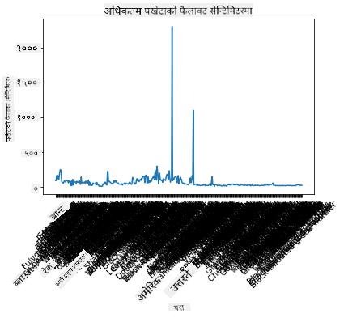
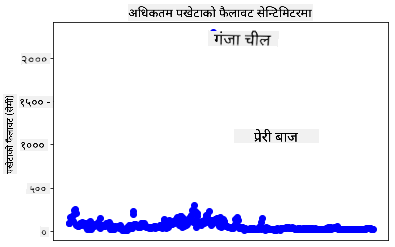
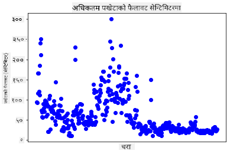
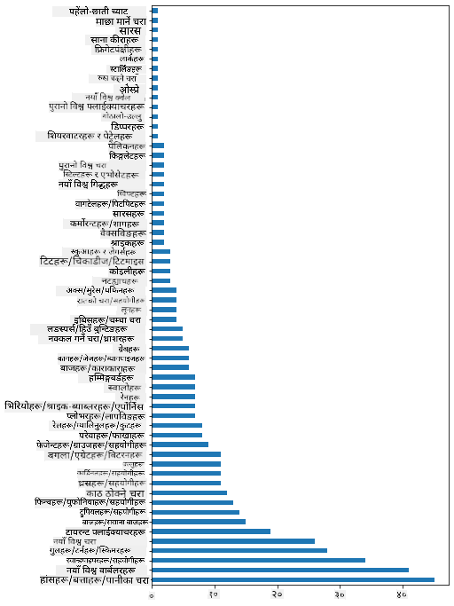
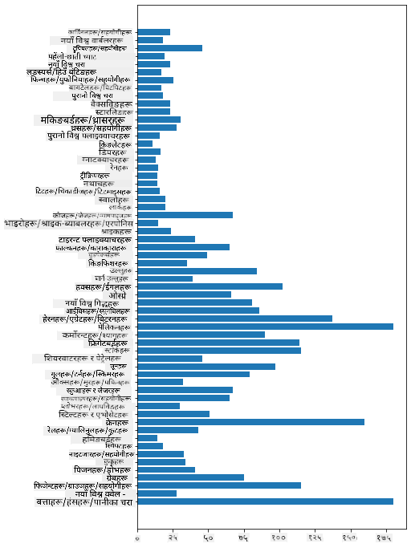
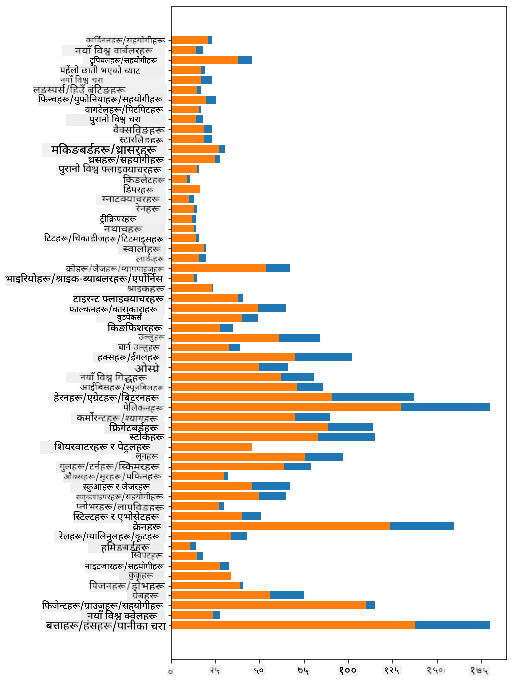

<!--
CO_OP_TRANSLATOR_METADATA:
{
  "original_hash": "43c402d9d90ae6da55d004519ada5033",
  "translation_date": "2025-08-27T18:39:58+00:00",
  "source_file": "3-Data-Visualization/09-visualization-quantities/README.md",
  "language_code": "ne"
}
-->
# परिमाणहरूको दृश्यात्मकता

| ](../../sketchnotes/09-Visualizing-Quantities.png)|
|:---:|
| परिमाणहरूको दृश्यात्मकता - _Sketchnote by [@nitya](https://twitter.com/nitya)_ |

यस पाठमा तपाईंले परिमाणको अवधारणालाई केन्द्रमा राखेर रोचक दृश्यात्मकता सिर्जना गर्नका लागि उपलब्ध धेरै Python पुस्तकालयहरू मध्ये एकको प्रयोग गर्न सिक्नुहुनेछ। मिनेसोटाका चराहरूको सफा गरिएको डेटासेट प्रयोग गरेर, तपाईंले स्थानीय वन्यजन्तुका बारेमा धेरै रोचक तथ्यहरू जान्न सक्नुहुन्छ।  
## [पाठपूर्व प्रश्नोत्तरी](https://purple-hill-04aebfb03.1.azurestaticapps.net/quiz/16)

## Matplotlib प्रयोग गरेर पखेटाको फैलावट अवलोकन गर्नुहोस्

[Matplotlib](https://matplotlib.org/stable/index.html) एउटा उत्कृष्ट पुस्तकालय हो जसले विभिन्न प्रकारका साधारण र जटिल प्लटहरू र चार्टहरू सिर्जना गर्न मद्दत गर्दछ। सामान्यतया, यी पुस्तकालयहरूको प्रयोग गरेर डेटा प्लट गर्ने प्रक्रियामा तपाईंको डेटा फ्रेमको लक्षित भागहरू पहिचान गर्नु, आवश्यक परिमार्जनहरू गर्नु, यसको x र y अक्ष मानहरू तोक्नु, कुन प्रकारको प्लट देखाउने निर्णय गर्नु, र त्यसपछि प्लट देखाउनु समावेश हुन्छ। Matplotlib ले धेरै प्रकारका दृश्यात्मकताहरू प्रदान गर्दछ, तर यस पाठका लागि, परिमाण देखाउन उपयुक्त चार्टहरूमा ध्यान केन्द्रित गरौं: लाइन चार्ट, स्क्याटरप्लट, र बार प्लट।

> ✅ तपाईंको डेटा संरचना र तपाईंले भन्न चाहेको कथालाई उपयुक्त बनाउने उत्तम चार्ट प्रयोग गर्नुहोस्।  
> - समयक्रममा प्रवृत्ति विश्लेषण गर्न: लाइन  
> - मानहरूको तुलना गर्न: बार, स्तम्भ, पाई, स्क्याटरप्लट  
> - भागहरू सम्पूर्णसँग कसरी सम्बन्धित छन् देखाउन: पाई  
> - डेटा वितरण देखाउन: स्क्याटरप्लट, बार  
> - प्रवृत्ति देखाउन: लाइन, स्तम्भ  
> - मानहरू बीचको सम्बन्ध देखाउन: लाइन, स्क्याटरप्लट, बबल  

यदि तपाईंसँग डेटासेट छ र कुनै वस्तुको कति मात्रामा समावेश छ भनेर पत्ता लगाउन आवश्यक छ भने, तपाईंको पहिलो कार्य यसको मानहरू निरीक्षण गर्नु हुनेछ।  

✅ Matplotlib का लागि धेरै राम्रो 'चीट शीट' [यहाँ](https://matplotlib.org/cheatsheets/cheatsheets.pdf) उपलब्ध छन्।

## पखेटाको फैलावटको बारेमा लाइन प्लट बनाउनुहोस्

यस पाठ फोल्डरको जडमा रहेको `notebook.ipynb` फाइल खोल्नुहोस् र एउटा सेल थप्नुहोस्।  

> नोट: डेटा यस रिपोजिटरीको जडमा रहेको `/data` फोल्डरमा भण्डारण गरिएको छ।  

```python
import pandas as pd
import matplotlib.pyplot as plt
birds = pd.read_csv('../../data/birds.csv')
birds.head()
```  
यो डेटा पाठ्य र संख्यात्मक मानहरूको मिश्रण हो:

|      | नाम                          | वैज्ञानिक नाम          | वर्ग                  | क्रम         | परिवार   | वंश         | संरक्षण स्थिति | न्यूनतम लम्बाइ | अधिकतम लम्बाइ | न्यूनतम शरीर भार | अधिकतम शरीर भार | न्यूनतम पखेटा फैलावट | अधिकतम पखेटा फैलावट |
| ---: | :--------------------------- | :--------------------- | :-------------------- | :----------- | :------- | :---------- | :----------------- | --------: | --------: | ----------: | ----------: | ----------: | ----------: |
|    0 | कालो-पेट भएको सिठ्ठी बतख     | Dendrocygna autumnalis | बतख/हंस/पानीपक्षी     | Anseriformes | Anatidae | Dendrocygna | LC                 |        47 |        56 |         652 |        1020 |          76 |          94 |
|    1 | फुल्भस सिठ्ठी बतख            | Dendrocygna bicolor    | बतख/हंस/पानीपक्षी     | Anseriformes | Anatidae | Dendrocygna | LC                 |        45 |        53 |         712 |        1050 |          85 |          93 |
|    2 | हिउँ हंस                     | Anser caerulescens     | बतख/हंस/पानीपक्षी     | Anseriformes | Anatidae | Anser       | LC                 |        64 |        79 |        2050 |        4050 |         135 |         165 |
|    3 | रॉसको हंस                    | Anser rossii           | बतख/हंस/पानीपक्षी     | Anseriformes | Anatidae | Anser       | LC                 |      57.3 |        64 |        1066 |        1567 |         113 |         116 |
|    4 | ठूलो सेतो-फ्रन्टेड हंस       | Anser albifrons        | बतख/हंस/पानीपक्षी     | Anseriformes | Anatidae | Anser       | LC                 |        64 |        81 |        1930 |        3310 |         130 |         165 |

आउनुहोस्, यी रोचक चराहरूको अधिकतम पखेटा फैलावटको दृश्यात्मकता बनाउन सुरु गरौं।  

```python
wingspan = birds['MaxWingspan'] 
wingspan.plot()
```  


तपाईंले के तुरुन्तै देख्नुभयो? कम्तीमा एउटा बाहिरको मान (outlier) देखिन्छ - यो त धेरै ठूलो पखेटा फैलावट हो! २३०० सेन्टिमिटर पखेटा फैलावट भनेको २३ मिटर हो - के मिनेसोटामा प्टेरोड्याक्टाइलहरू छन्? अनुसन्धान गरौं।  

तपाईं Excel मा छिटो सर्ट गरेर यी बाहिरका मानहरू (जसलाई सम्भवतः टाइपो हो) पत्ता लगाउन सक्नुहुन्छ, तर प्लटभित्रैबाट काम गर्दै दृश्यात्मकता प्रक्रिया जारी राख्नुहोस्।  

x-अक्षमा लेबलहरू थपेर कुन प्रकारका चराहरू छन् भनेर देखाउनुहोस्:  

```
plt.title('Max Wingspan in Centimeters')
plt.ylabel('Wingspan (CM)')
plt.xlabel('Birds')
plt.xticks(rotation=45)
x = birds['Name'] 
y = birds['MaxWingspan']

plt.plot(x, y)

plt.show()
```  


लेबलहरूलाई ४५ डिग्रीमा घुमाउँदा पनि, धेरै पढ्न गाह्रो छ। अर्को रणनीति प्रयास गरौं: केवल ती बाहिरका मानहरूलाई लेबल गर्नुहोस् र चार्टभित्रै लेबल सेट गर्नुहोस्। तपाईंले स्क्याटर चार्ट प्रयोग गरेर लेबलिङको लागि थप ठाउँ बनाउन सक्नुहुन्छ:  

```python
plt.title('Max Wingspan in Centimeters')
plt.ylabel('Wingspan (CM)')
plt.tick_params(axis='both',which='both',labelbottom=False,bottom=False)

for i in range(len(birds)):
    x = birds['Name'][i]
    y = birds['MaxWingspan'][i]
    plt.plot(x, y, 'bo')
    if birds['MaxWingspan'][i] > 500:
        plt.text(x, y * (1 - 0.05), birds['Name'][i], fontsize=12)
    
plt.show()
```  
यहाँ के भइरहेको छ? तपाईंले `tick_params` प्रयोग गरेर तलका लेबलहरू लुकाउनुभयो र त्यसपछि तपाईंको चराहरूको डेटासेटमा लूप सिर्जना गर्नुभयो। `bo` प्रयोग गरेर साना निलो गोलाकार बिन्दुहरू प्लट गर्दै, तपाईंले अधिकतम पखेटा फैलावट ५०० भन्दा बढी भएका चराहरू जाँच्नुभयो र यदि त्यस्तो भएमा बिन्दुको छेउमा तिनीहरूको नाम देखाउनुभयो। तपाईंले लेबलहरू y-अक्षमा अलिकति सार्नुभयो (`y * (1 - 0.05)`) र चराको नामलाई लेबलको रूपमा प्रयोग गर्नुभयो।  

तपाईंले के पत्ता लगाउनुभयो?  

  
## तपाईंको डेटा फिल्टर गर्नुहोस्  

बाल्ड ईगल र प्रेरी फाल्कन, सम्भवतः धेरै ठूला चराहरू भए पनि, तिनीहरूको अधिकतम पखेटा फैलावटमा अतिरिक्त `0` थपिएको जस्तो देखिन्छ। २५ मिटर पखेटा फैलावट भएको बाल्ड ईगल भेट्न सम्भावना छैन, तर यदि भेट्नुभयो भने, कृपया हामीलाई जानकारी दिनुहोस्! ती दुई बाहिरका मानहरू बिना नयाँ डेटाफ्रेम सिर्जना गरौं:  

```python
plt.title('Max Wingspan in Centimeters')
plt.ylabel('Wingspan (CM)')
plt.xlabel('Birds')
plt.tick_params(axis='both',which='both',labelbottom=False,bottom=False)
for i in range(len(birds)):
    x = birds['Name'][i]
    y = birds['MaxWingspan'][i]
    if birds['Name'][i] not in ['Bald eagle', 'Prairie falcon']:
        plt.plot(x, y, 'bo')
plt.show()
```  

बाहिरका मानहरू फिल्टर गरेर, तपाईंको डेटा अब बढी सुसंगत र बुझ्न सजिलो भएको छ।  

  

अब हामीसँग पखेटा फैलावटको हिसाबले सफा डेटासेट छ, आउनुहोस् यी चराहरूको बारेमा थप पत्ता लगाऔं।  

लाइन र स्क्याटर प्लटहरूले डेटा मानहरू र तिनीहरूको वितरणको बारेमा जानकारी देखाउन सक्छन्, तर हामी यस डेटासेटमा निहित मानहरूको बारेमा सोच्न चाहन्छौं। तपाईंले परिमाणको बारेमा निम्न प्रश्नहरूको उत्तर दिन दृश्यात्मकता सिर्जना गर्न सक्नुहुन्छ:  

> कति वर्गका चराहरू छन्, र तिनीहरूको संख्या कति छ?  
> कति चरा लोप भएका, संकटग्रस्त, दुर्लभ, वा सामान्य छन्?  
> लिनियसको शब्दावलीमा विभिन्न वंश र क्रमहरूको संख्या कति छ?  
## बार चार्टहरूको अन्वेषण गर्नुहोस्  

जब तपाईंलाई डेटा समूहहरूको प्रदर्शन गर्न आवश्यक हुन्छ, बार चार्टहरू व्यावहारिक हुन्छन्। यस डेटासेटमा रहेका चराहरूका वर्गहरूको अन्वेषण गरौं ताकि कुन वर्ग सबैभन्दा सामान्य छ भनेर थाहा पाउन सकियोस्।  

नोटबुक फाइलमा एउटा आधारभूत बार चार्ट सिर्जना गर्नुहोस्।  

✅ नोट, तपाईंले अघिल्लो खण्डमा पहिचान गरिएका दुई बाहिरका चराहरूलाई फिल्टर गर्न सक्नुहुन्छ, तिनीहरूको पखेटा फैलावटमा टाइपो सम्पादन गर्न सक्नुहुन्छ, वा यी अभ्यासहरूमा तिनीहरूलाई समावेश गर्न सक्नुहुन्छ जसले पखेटा फैलावट मानहरूमा निर्भर गर्दैन।  

यदि तपाईं बार चार्ट सिर्जना गर्न चाहनुहुन्छ भने, तपाईंले ध्यान केन्द्रित गर्न चाहेको डेटा चयन गर्न सक्नुहुन्छ। बार चार्टहरू कच्चा डेटाबाट सिर्जना गर्न सकिन्छ:  

```python
birds.plot(x='Category',
        kind='bar',
        stacked=True,
        title='Birds of Minnesota')

```  
  

तर यो बार चार्ट पढ्न गाह्रो छ किनभने धेरै गैर-समूहित डेटा छ। तपाईंले केवल प्लट गर्न चाहेको डेटा चयन गर्न आवश्यक छ, त्यसैले चराहरूको वर्गको आधारमा तिनीहरूको लम्बाइ हेर्नुहोस्।  

तपाईंको डेटा केवल चराहरूको वर्ग समावेश गर्न फिल्टर गर्नुहोस्।  

✅ ध्यान दिनुहोस् कि तपाईंले डेटा व्यवस्थापन गर्न Pandas प्रयोग गर्नुहुन्छ, र त्यसपछि चार्टिङ गर्न Matplotlib प्रयोग गर्नुहुन्छ।  

किनभने धेरै वर्गहरू छन्, तपाईंले यो चार्ट ठाडो रूपमा प्रदर्शन गर्न सक्नुहुन्छ र सबै डेटा समेट्न यसको उचाइ समायोजन गर्न सक्नुहुन्छ:  

```python
category_count = birds.value_counts(birds['Category'].values, sort=True)
plt.rcParams['figure.figsize'] = [6, 12]
category_count.plot.barh()
```  
  

यो बार चार्टले प्रत्येक वर्गमा रहेका चराहरूको संख्या राम्रोसँग देखाउँछ। एक झलकमा, तपाईंले देख्न सक्नुहुन्छ कि यस क्षेत्रमा सबैभन्दा धेरै चरा बतख/हंस/पानीपक्षी वर्गमा छन्। मिनेसोटा '१०,००० तालहरूको भूमि' भएकाले यो आश्चर्यजनक छैन!  

✅ यस डेटासेटमा केही अन्य गणनाहरू प्रयास गर्नुहोस्। के तपाईंलाई केही चकित पार्छ?  

## डेटा तुलना गर्नुहोस्  

तपाईंले नयाँ अक्ष सिर्जना गरेर समूहित डेटाको विभिन्न तुलना प्रयास गर्न सक्नुहुन्छ। चराको वर्गको आधारमा चराको अधिकतम लम्बाइको तुलना प्रयास गर्नुहोस्:  

```python
maxlength = birds['MaxLength']
plt.barh(y=birds['Category'], width=maxlength)
plt.rcParams['figure.figsize'] = [6, 12]
plt.show()
```  
  

यहाँ केही आश्चर्यजनक छैन: हमिंगबर्डहरूको अधिकतम लम्बाइ पेलिकन वा हंसको तुलनामा सबैभन्दा कम छ। जब डेटा तार्किक रूपमा अर्थपूर्ण हुन्छ, यो राम्रो कुरा हो!  

तपाईंले बार चार्टहरूको थप रोचक दृश्यात्मकता सिर्जना गर्न डेटा सुपरइम्पोज गर्न सक्नुहुन्छ। आउनुहोस्, कुनै दिइएको चराको वर्गमा न्यूनतम र अधिकतम लम्बाइ सुपरइम्पोज गरौं:  

```python
minLength = birds['MinLength']
maxLength = birds['MaxLength']
category = birds['Category']

plt.barh(category, maxLength)
plt.barh(category, minLength)

plt.show()
```  
यस प्लटमा, तपाईंले न्यूनतम लम्बाइ र अधिकतम लम्बाइको दायरा प्रति चराको वर्ग देख्न सक्नुहुन्छ। तपाईं सुरक्षित रूपमा भन्न सक्नुहुन्छ कि, यो डेटाका आधारमा, चरा जति ठूलो हुन्छ, यसको लम्बाइ दायरा त्यति नै ठूलो हुन्छ। रोचक!  

  

## 🚀 चुनौती  

यो चराको डेटासेटले विशेष पारिस्थितिकी तन्त्रभित्रका विभिन्न प्रकारका चराहरूको बारेमा जानकारीको खजाना प्रदान गर्दछ। इन्टरनेटमा खोजी गर्नुहोस् र अन्य चरा-उन्मुख डेटासेटहरू फेला पार्न प्रयास गर्नुहोस्। यी चराहरूको वरिपरि चार्ट र ग्राफहरू निर्माण गर्ने अभ्यास गर्नुहोस् ताकि तपाईंले नबुझेका तथ्यहरू पत्ता लगाउन सक्नुहुन्छ।  
## [पाठपछिको प्रश्नोत्तरी](https://purple-hill-04aebfb03.1.azurestaticapps.net/quiz/17)

## समीक्षा र आत्म-अध्ययन  

यस पहिलो पाठले तपाईंलाई परिमाणहरू दृश्यात्मक बनाउन Matplotlib प्रयोग गर्ने केही जानकारी दिएको छ। दृश्यात्मकताका लागि डेटासेटहरूसँग काम गर्ने अन्य तरिकाहरूको बारेमा अनुसन्धान गर्नुहोस्। [Plotly](https://github.com/plotly/plotly.py) एउटा हो जसलाई हामी यी पाठहरूमा समेट्ने छैनौं, त्यसैले यसले के प्रस्ताव गर्न सक्छ हेर्नुहोस्।  
## असाइनमेन्ट  

[लाइन, स्क्याटर, र बारहरू](assignment.md)  

---

**अस्वीकरण**:  
यो दस्तावेज़ AI अनुवाद सेवा [Co-op Translator](https://github.com/Azure/co-op-translator) प्रयोग गरेर अनुवाद गरिएको छ। हामी शुद्धताको लागि प्रयास गर्छौं, तर कृपया ध्यान दिनुहोस् कि स्वचालित अनुवादहरूमा त्रुटि वा अशुद्धता हुन सक्छ। यसको मूल भाषा मा रहेको मूल दस्तावेज़लाई आधिकारिक स्रोत मानिनुपर्छ। महत्वपूर्ण जानकारीको लागि, व्यावसायिक मानव अनुवाद सिफारिस गरिन्छ। यस अनुवादको प्रयोगबाट उत्पन्न हुने कुनै पनि गलतफहमी वा गलत व्याख्याको लागि हामी जिम्मेवार हुने छैनौं।